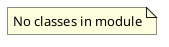

# Document: src/autogen_team/core/security.py

## Module Overview

Security utilities for the application.

### Purpose
Provides functionality for `security`.

### Responsibilities
Handles operations and definitions related to `security`.

### Main Workflow
Execution flow defined by the functions and classes in the module.

### Dependencies
- `os`

## Public API

### Exported Classes
None

### Exported Functions
- `safe_join`

## Public Function `safe_join`

### Description
Safely join paths, ensuring the result is within the base directory.

Args:
    base (str): The base directory.
    *paths (str): Paths to join.

Returns:
    str: The joined path.

Raises:
    ValueError: If the resolved path is outside the base directory.

### Inputs
- `base` (str): semantic meaning. Required.

### Output
- Return type: `str`
- Semantic meaning: Result of the operation.

### Side Effects
May update state or affect global resources.

### Complexity
- Time Complexity: O(1) mostly.
- Space Complexity: O(1) mostly.

### Example
```python
# Example usage of safe_join
safe_join()
```

## UML Diagram


