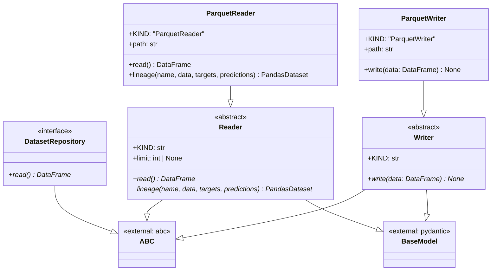
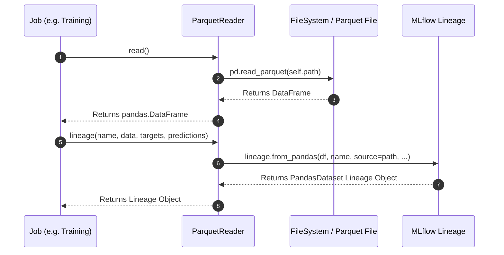

# Module Name: data_access

* **Source Directory Reference:** `src/autogen_team/data_access/`
* **Package Dependency:** Upstream: `pandas`, `pydantic`, `mlflow.data.pandas_dataset`. Downstream: `src/autogen_team/application/jobs/`, `src/autogen_team/models/`.

## 1. Executive Summary & Purpose

The `data_access` module provides clean abstractions for reading, writing, and tracking dataset lineage across external storage targets (local file system, Cloud Storage, S3 Parquet). It defines the `DatasetRepository` interface and concrete readers/writers (`Reader`, `ParquetReader`, `Writer`, `ParquetWriter`) integrated with MLflow data lineage tracking.

## 2. UML 2.0 Class & Inheritance Architecture (Deterministic)

## 3. Package & Class Relations

* **Inheritance & Abstraction:** Both `Reader` and `Writer` inherit from `abc.ABC` and `pydantic.BaseModel` with `strict=True`, `frozen=True`, and `extra="forbid"`.
* **Parquet Serialization:** `ParquetReader` loads Parquet files into `pandas.DataFrame` objects and applies row-limit truncation when specified. `ParquetWriter` persists `pandas.DataFrame` objects back to disk.
* **Lineage Tracking:** `Reader.lineage()` constructs an `mlflow.data.pandas_dataset.PandasDataset` instance linking input DataFrames to MLflow run metadata.

## 4. Execution Flow & Runtime Behavior

---

* **Source Citations:**
  * Dataset Repository Interface: `src/autogen_team/data_access/repositories.py:8-14`
  * Abstract Reader & ParquetReader: `src/autogen_team/data_access/adapters/datasets.py:19-92`
  * Abstract Writer & ParquetWriter: `src/autogen_team/data_access/adapters/datasets.py:97-130`
