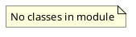

# Document: src/autogen_team/data_access/adapters/__init__.py

## Module Overview

Data Access Adapters.

### Purpose
Provides functionality for `__init__`.

### Responsibilities
Handles operations and definitions related to `__init__`.

### Main Workflow
Execution flow defined by the functions and classes in the module.

### Dependencies
- `datasets.Lineage`
- `datasets.ParquetReader`
- `datasets.ParquetWriter`
- `datasets.Reader`
- `datasets.ReaderKind`
- `datasets.Writer`
- `datasets.WriterKind`

## Public API

### Exported Classes
None

### Exported Functions
None

## UML Diagram

