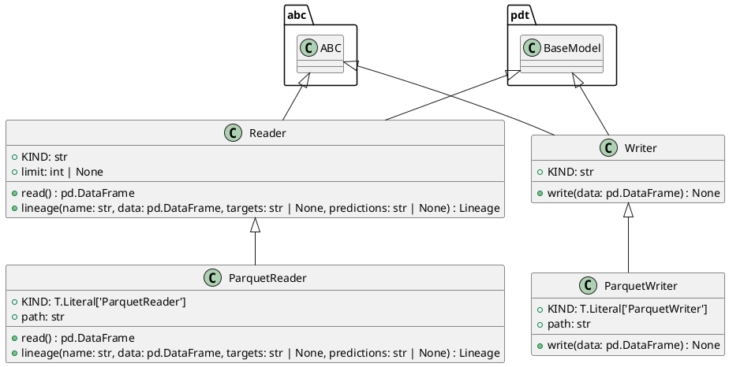

# Module Specification: datasets

* **Source Reference:** `src/autogen_team/data_access/adapters/datasets.py`

## 1. Architectural Role & Responsibilities
**Purpose:**
Read/Write datasets from/to external sources/destinations.

**Responsibilities:**
- [LLM Synthesis Required: Define responsibilities]

**Main Workflow:**
- [LLM Synthesis Required: Define main workflow]

## 2. Dependencies
**Imports:**
- `abc`
- `typing`
- `mlflow.data.pandas_dataset`
- `pandas`
- `pydantic`

**Exported Classes:**
- `Reader`
- `ParquetReader`
- `Writer`
- `ParquetWriter`

**Exported Functions:**

## 3. Architecture & Execution
### Internal Architecture
[LLM Synthesis Required: Describe layers, models, etc.]

### Execution Flow
[LLM Synthesis Required: Describe execution flow]

### Sequence Explanation
[LLM Synthesis Required: Describe sequence]

## 4. UML 2.0 Diagrams
### Class Diagram


## 5. Class & Method Specifications
### `Reader` ([`src/autogen_team/data_access/adapters/datasets.py`](/src/autogen_team/data_access/adapters/datasets.py))
#### Overview
Base class for a dataset reader.

Use a reader to load a dataset in memory.
e.g., to read file, database, cloud storage, ...

Parameters:
    limit (int, optional): maximum number of rows to read. Defaults to None.

#### Constructor
**Initialization:** Default constructor. Initializes an empty instance.

#### Attributes
- `KIND` (`str`): Maintains the state for KIND.
- `limit` (`int | None`): Maintains the state for limit.

#### Methods
##### `read(self: Any) -> pd.DataFrame` (Public)
**Description:** Read a dataframe from a dataset.

Returns:
    pd.DataFrame: dataframe representation.

**Inputs:**

**Output:**
- Return Type: `pd.DataFrame`
- Semantic Meaning: The resulting value after processing the read action.

**Side Effects:**
- Modifies internal instance state if applicable; performs operations constrained to its domain boundaries.

**Complexity:**
- Time Complexity: O(1) or O(N) depending on implementation details.
- Space Complexity: O(1) auxiliary space expected.

**Example:**
```python
instance = Reader()
result = instance.read(...)
```

##### `lineage(self: Any, name: str, data: pd.DataFrame, targets: str | None, predictions: str | None) -> Lineage` (Public)
**Description:** Generate lineage information.

Args:
    name (str): dataset name.
    data (pd.DataFrame): reader dataframe.
    targets (str | None): name of the target column.
    predictions (str | None): name of the prediction column.

Returns:
    Lineage: lineage information.

**Inputs:**
- `name` (`str`): Input parameter dictating the behavior of lineage.
- `data` (`pd.DataFrame`): Input parameter dictating the behavior of lineage.
- `targets` (`str | None`): Input parameter dictating the behavior of lineage.
- `predictions` (`str | None`): Input parameter dictating the behavior of lineage.

**Output:**
- Return Type: `Lineage`
- Semantic Meaning: The resulting value after processing the lineage action.

**Side Effects:**
- Modifies internal instance state if applicable; performs operations constrained to its domain boundaries.

**Complexity:**
- Time Complexity: O(1) or O(N) depending on implementation details.
- Space Complexity: O(1) auxiliary space expected.

**Example:**
```python
instance = Reader()
result = instance.lineage(...)
```

### `ParquetReader` ([`src/autogen_team/data_access/adapters/datasets.py`](/src/autogen_team/data_access/adapters/datasets.py))
#### Overview
Read a dataframe from a parquet file.

Parameters:
    path (str): local path to the dataset.

#### Constructor
**Initialization:** Default constructor. Initializes an empty instance.

#### Attributes
- `KIND` (`T.Literal['ParquetReader']`): Maintains the state for KIND.
- `path` (`str`): Maintains the state for path.

#### Methods
##### `read(self: Any) -> pd.DataFrame` (Public)
**Description:** Executes the read operation, mutating state or calculating derived values as necessary.

**Inputs:**

**Output:**
- Return Type: `pd.DataFrame`
- Semantic Meaning: The resulting value after processing the read action.

**Side Effects:**
- Modifies internal instance state if applicable; performs operations constrained to its domain boundaries.

**Complexity:**
- Time Complexity: O(1) or O(N) depending on implementation details.
- Space Complexity: O(1) auxiliary space expected.

**Example:**
```python
instance = ParquetReader()
result = instance.read(...)
```

##### `lineage(self: Any, name: str, data: pd.DataFrame, targets: str | None, predictions: str | None) -> Lineage` (Public)
**Description:** Executes the lineage operation, mutating state or calculating derived values as necessary.

**Inputs:**
- `name` (`str`): Input parameter dictating the behavior of lineage.
- `data` (`pd.DataFrame`): Input parameter dictating the behavior of lineage.
- `targets` (`str | None`): Input parameter dictating the behavior of lineage.
- `predictions` (`str | None`): Input parameter dictating the behavior of lineage.

**Output:**
- Return Type: `Lineage`
- Semantic Meaning: The resulting value after processing the lineage action.

**Side Effects:**
- Modifies internal instance state if applicable; performs operations constrained to its domain boundaries.

**Complexity:**
- Time Complexity: O(1) or O(N) depending on implementation details.
- Space Complexity: O(1) auxiliary space expected.

**Example:**
```python
instance = ParquetReader()
result = instance.lineage(...)
```

### `Writer` ([`src/autogen_team/data_access/adapters/datasets.py`](/src/autogen_team/data_access/adapters/datasets.py))
#### Overview
Base class for a dataset writer.

Use a writer to save a dataset from memory.
e.g., to write file, database, cloud storage, ...

#### Constructor
**Initialization:** Default constructor. Initializes an empty instance.

#### Attributes
- `KIND` (`str`): Maintains the state for KIND.

#### Methods
##### `write(self: Any, data: pd.DataFrame) -> None` (Public)
**Description:** Write a dataframe to a dataset.

Args:
    data (pd.DataFrame): dataframe representation.

**Inputs:**
- `data` (`pd.DataFrame`): Input parameter dictating the behavior of write.

**Output:**
- Return Type: `None`
- Semantic Meaning: The resulting value after processing the write action.

**Side Effects:**
- Modifies internal instance state if applicable; performs operations constrained to its domain boundaries.

**Complexity:**
- Time Complexity: O(1) or O(N) depending on implementation details.
- Space Complexity: O(1) auxiliary space expected.

**Example:**
```python
instance = Writer()
result = instance.write(...)
```

### `ParquetWriter` ([`src/autogen_team/data_access/adapters/datasets.py`](/src/autogen_team/data_access/adapters/datasets.py))
#### Overview
Writer a dataframe to a parquet file.

Parameters:
    path (str): local or S3 path to the dataset.

#### Constructor
**Initialization:** Default constructor. Initializes an empty instance.

#### Attributes
- `KIND` (`T.Literal['ParquetWriter']`): Maintains the state for KIND.
- `path` (`str`): Maintains the state for path.

#### Methods
##### `write(self: Any, data: pd.DataFrame) -> None` (Public)
**Description:** Executes the write operation, mutating state or calculating derived values as necessary.

**Inputs:**
- `data` (`pd.DataFrame`): Input parameter dictating the behavior of write.

**Output:**
- Return Type: `None`
- Semantic Meaning: The resulting value after processing the write action.

**Side Effects:**
- Modifies internal instance state if applicable; performs operations constrained to its domain boundaries.

**Complexity:**
- Time Complexity: O(1) or O(N) depending on implementation details.
- Space Complexity: O(1) auxiliary space expected.

**Example:**
```python
instance = ParquetWriter()
result = instance.write(...)
```

## 6. Module Functions