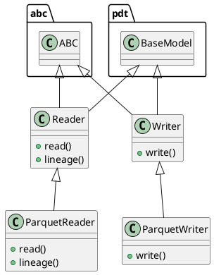

# Document: src/autogen_team/data_access/adapters/datasets.py

## Module Overview

Read/Write datasets from/to external sources/destinations.

### Purpose
Provides functionality for `datasets`.

### Responsibilities
Handles operations and definitions related to `datasets`.

### Main Workflow
Execution flow defined by the functions and classes in the module.

### Dependencies
- `abc`
- `typing`
- `mlflow.data.pandas_dataset`
- `pandas`
- `pydantic`

## Public API

### Exported Classes
- `Reader`
- `ParquetReader`
- `Writer`
- `ParquetWriter`

### Exported Functions
None

## Class `Reader`

### Overview

Base class for a dataset reader.

Use a reader to load a dataset in memory.
e.g., to read file, database, cloud storage, ...

Parameters:
    limit (int, optional): maximum number of rows to read. Defaults to None.

### Attributes

- `KIND` (str): Public property.
- `limit` (int | None): Public property.

### Public Method `read`

#### Description
Read a dataframe from a dataset.

Returns:
    pd.DataFrame: dataframe representation.

#### Inputs
None

#### Output
- Return type: `pd.DataFrame`
- Semantic meaning: Result of the operation.

#### Side Effects
May update internal state or external services.

#### Complexity
- Time Complexity: O(1) mostly.
- Space Complexity: O(1) mostly.

#### Example
```python
# Example usage of read
instance.read()
```

### Public Method `lineage`

#### Description
Generate lineage information.

Args:
    name (str): dataset name.
    data (pd.DataFrame): reader dataframe.
    targets (str | None): name of the target column.
    predictions (str | None): name of the prediction column.

Returns:
    Lineage: lineage information.

#### Inputs
- `name` (str): semantic meaning. Required.
- `data` (pd.DataFrame): semantic meaning. Required.
- `targets` (str | None): semantic meaning. Optional (default: `None`).
- `predictions` (str | None): semantic meaning. Optional (default: `None`).

#### Output
- Return type: `Lineage`
- Semantic meaning: Result of the operation.

#### Side Effects
May update internal state or external services.

#### Complexity
- Time Complexity: O(1) mostly.
- Space Complexity: O(1) mostly.

#### Example
```python
# Example usage of lineage
instance.lineage()
```

## Class `ParquetReader`

### Overview

Read a dataframe from a parquet file.

Parameters:
    path (str): local path to the dataset.

### Attributes

- `KIND` (T.Literal[ParquetReader]): Public property.
- `path` (str): Public property.

### Public Method `read`

#### Description
No description provided.

#### Inputs
None

#### Output
- Return type: `pd.DataFrame`
- Semantic meaning: Result of the operation.

#### Side Effects
May update internal state or external services.

#### Complexity
- Time Complexity: O(1) mostly.
- Space Complexity: O(1) mostly.

#### Example
```python
# Example usage of read
instance.read()
```

### Public Method `lineage`

#### Description
No description provided.

#### Inputs
- `name` (str): semantic meaning. Required.
- `data` (pd.DataFrame): semantic meaning. Required.
- `targets` (str | None): semantic meaning. Optional (default: `None`).
- `predictions` (str | None): semantic meaning. Optional (default: `None`).

#### Output
- Return type: `Lineage`
- Semantic meaning: Result of the operation.

#### Side Effects
May update internal state or external services.

#### Complexity
- Time Complexity: O(1) mostly.
- Space Complexity: O(1) mostly.

#### Example
```python
# Example usage of lineage
instance.lineage()
```

## Class `Writer`

### Overview

Base class for a dataset writer.

Use a writer to save a dataset from memory.
e.g., to write file, database, cloud storage, ...

### Attributes

- `KIND` (str): Public property.

### Public Method `write`

#### Description
Write a dataframe to a dataset.

Args:
    data (pd.DataFrame): dataframe representation.

#### Inputs
- `data` (pd.DataFrame): semantic meaning. Required.

#### Output
- Return type: `None`
- Semantic meaning: Result of the operation.

#### Side Effects
May update internal state or external services.

#### Complexity
- Time Complexity: O(1) mostly.
- Space Complexity: O(1) mostly.

#### Example
```python
# Example usage of write
instance.write()
```

## Class `ParquetWriter`

### Overview

Writer a dataframe to a parquet file.

Parameters:
    path (str): local or S3 path to the dataset.

### Attributes

- `KIND` (T.Literal[ParquetWriter]): Public property.
- `path` (str): Public property.

### Public Method `write`

#### Description
No description provided.

#### Inputs
- `data` (pd.DataFrame): semantic meaning. Required.

#### Output
- Return type: `None`
- Semantic meaning: Result of the operation.

#### Side Effects
May update internal state or external services.

#### Complexity
- Time Complexity: O(1) mostly.
- Space Complexity: O(1) mostly.

#### Example
```python
# Example usage of write
instance.write()
```

## UML Diagram



