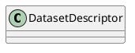

# Document: src/autogen_team/data_access/entities.py

## Module Overview

Data Access Domain Entities.

### Purpose
Provides functionality for `entities`.

### Responsibilities
Handles operations and definitions related to `entities`.

### Main Workflow
Execution flow defined by the functions and classes in the module.

### Dependencies
- `dataclasses.dataclass`
- `typing.Optional`

## Public API

### Exported Classes
- `DatasetDescriptor`

### Exported Functions
None

## Class `DatasetDescriptor`

### Overview

Describes a dataset source.

### Attributes

- `name` (str): Public property.
- `path` (str): Public property.
- `format` (str): Public property.
- `columns` (Optional[list[str]]): Public property.

## UML Diagram

