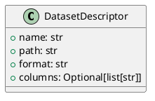

# Module Specification: entities

* **Source Reference:** `src/autogen_team/data_access/entities.py`

## 1. Architectural Role & Responsibilities
**Purpose:**
Data Access Domain Entities.

**Responsibilities:**
- [LLM Synthesis Required: Define responsibilities]

**Main Workflow:**
- [LLM Synthesis Required: Define main workflow]

## 2. Dependencies
**Imports:**
- `dataclasses.dataclass`
- `typing.Optional`

**Exported Classes:**
- `DatasetDescriptor`

**Exported Functions:**

## 3. Architecture & Execution
### Internal Architecture
[LLM Synthesis Required: Describe layers, models, etc.]

### Execution Flow
[LLM Synthesis Required: Describe execution flow]

### Sequence Explanation
[LLM Synthesis Required: Describe sequence]

## 4. UML 2.0 Diagrams
### Class Diagram

## 5. Class & Method Specifications
### `DatasetDescriptor` ([`src/autogen_team/data_access/entities.py`](/src/autogen_team/data_access/entities.py))
#### Overview
Describes a dataset source.

#### Constructor
**Initialization:** Default constructor. Initializes an empty instance.

#### Attributes
- `name` (`str`): Maintains the state for name.
- `path` (`str`): Maintains the state for path.
- `format` (`str`): Maintains the state for format.
- `columns` (`Optional[list[str]]`): Maintains the state for columns.

#### Methods
## 6. Module Functions