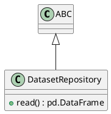

# Module Specification: repositories

* **Source Reference:** `src/autogen_team/data_access/repositories.py`

## 1. Architectural Role & Responsibilities
**Purpose:**
Data Access Repository Interface.

**Responsibilities:**
- [LLM Synthesis Required: Define responsibilities]

**Main Workflow:**
- [LLM Synthesis Required: Define main workflow]

## 2. Dependencies
**Imports:**
- `abc.ABC`
- `abc.abstractmethod`
- `pandas`

**Exported Classes:**
- `DatasetRepository`

**Exported Functions:**

## 3. Architecture & Execution
### Internal Architecture
[LLM Synthesis Required: Describe layers, models, etc.]

### Execution Flow
[LLM Synthesis Required: Describe execution flow]

### Sequence Explanation
[LLM Synthesis Required: Describe sequence]

## 4. UML 2.0 Diagrams
### Class Diagram


## 5. Class & Method Specifications
### `DatasetRepository` ([`src/autogen_team/data_access/repositories.py`](/src/autogen_team/data_access/repositories.py))
#### Overview
Abstract repository for dataset access.

#### Constructor
**Initialization:** Default constructor. Initializes an empty instance.

#### Methods
##### `read(self: Any) -> pd.DataFrame` (Public)
**Description:** Read dataset into DataFrame.

**Inputs:**

**Output:**
- Return Type: `pd.DataFrame`
- Semantic Meaning: The resulting value after processing the read action.

**Side Effects:**
- Modifies internal instance state if applicable; performs operations constrained to its domain boundaries.

**Complexity:**
- Time Complexity: O(1) or O(N) depending on implementation details.
- Space Complexity: O(1) auxiliary space expected.

**Example:**
```python
instance = DatasetRepository()
result = instance.read(...)
```

## 6. Module Functions