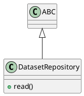

# Document: src/autogen_team/data_access/repositories.py

## Module Overview

Data Access Repository Interface.

### Purpose
Provides functionality for `repositories`.

### Responsibilities
Handles operations and definitions related to `repositories`.

### Main Workflow
Execution flow defined by the functions and classes in the module.

### Dependencies
- `abc.ABC`
- `abc.abstractmethod`
- `pandas`

## Public API

### Exported Classes
- `DatasetRepository`

### Exported Functions
None

## Class `DatasetRepository`

### Overview

Abstract repository for dataset access.

### Public Method `read`

#### Description
Read dataset into DataFrame.

#### Inputs
None

#### Output
- Return type: `pd.DataFrame`
- Semantic meaning: Result of the operation.

#### Side Effects
May update internal state or external services.

#### Complexity
- Time Complexity: O(1) mostly.
- Space Complexity: O(1) mostly.

#### Example
```python
# Example usage of read
instance.read()
```

## UML Diagram



