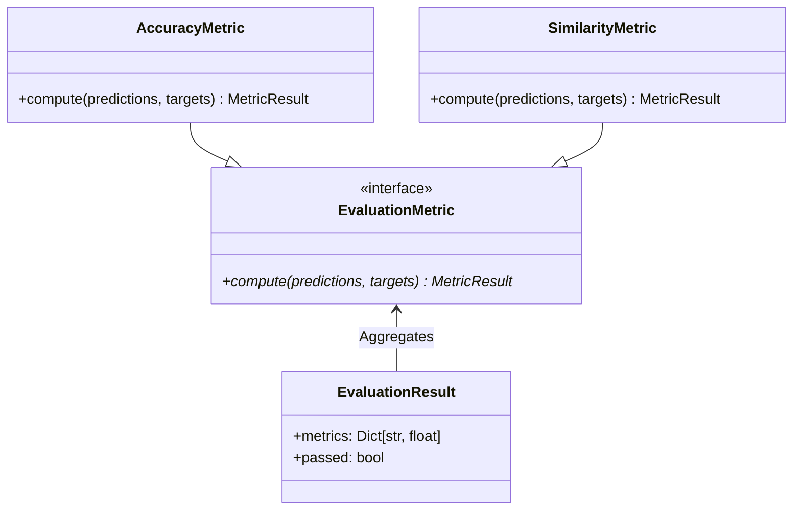
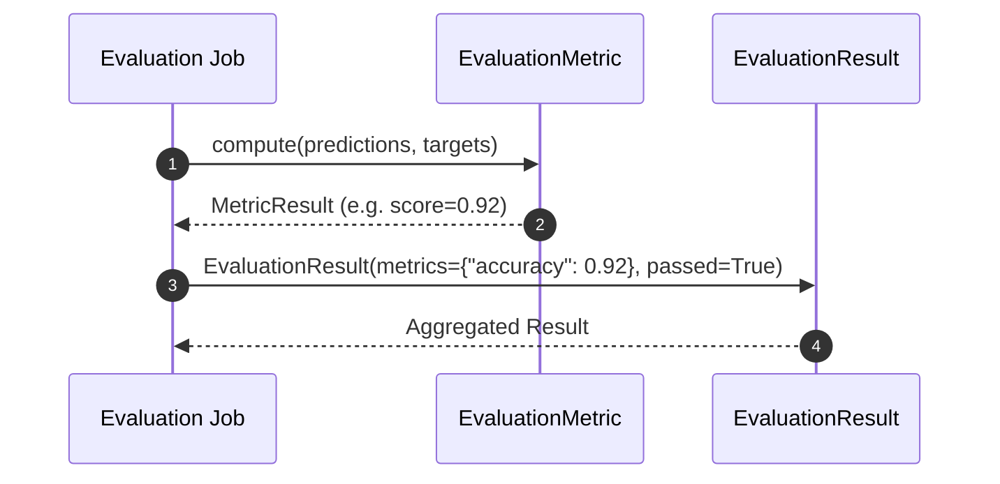

# Module Name: evaluation

* **Source Directory Reference:** `src/autogen_team/evaluation/`
* **Package Dependency:** Upstream: `pandas`, `pydantic`. Downstream: `src/autogen_team/application/jobs/evaluations.py`.

## 1. Executive Summary & Purpose

The `evaluation` module provides metric evaluation calculation logic and result container structures. It measures prediction accuracy, similarity, token usage, latency, and quality benchmarks for LLM responses.

## 2. UML 2.0 Class & Metrics Architecture (Deterministic)

## 3. Package & Class Relations

* **Metric Computing:** Calculates evaluation benchmarks between model output predictions (`OutputsSchema`) and expected ground truth targets (`TargetsSchema`).
* **Result Aggregation:** `EvaluationResult` packages numeric metrics and Boolean assertion checks used by `Evaluations` job and `Promotion` job.

## 4. Execution Flow & Runtime Behavior

---

* **Source Citations:**
  * Evaluation Entities: `src/autogen_team/evaluation/entities.py:1-25`
  * Metrics Implementations: `src/autogen_team/evaluation/metrics/metrics.py:1-35`
