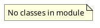

# Document: src/autogen_team/evaluation/__init__.py

## Module Overview

Evaluation Domain - Metrics and model evaluation.

### Purpose
Provides functionality for `__init__`.

### Responsibilities
Handles operations and definitions related to `__init__`.

### Main Workflow
Execution flow defined by the functions and classes in the module.

### Dependencies
- `entities.MetricResult`
- `metrics.AutogenMetric`
- `metrics.Metric`
- `metrics.MetricKind`
- `metrics.MetricsKind`
- `metrics.MlflowModelValidationFailedException`
- `metrics.Threshold`

## Public API

### Exported Classes
None

### Exported Functions
None

## UML Diagram

