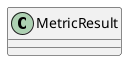

# Document: src/autogen_team/evaluation/entities.py

## Module Overview

Evaluation Domain Entities.

### Purpose
Provides functionality for `entities`.

### Responsibilities
Handles operations and definitions related to `entities`.

### Main Workflow
Execution flow defined by the functions and classes in the module.

### Dependencies
- `dataclasses.dataclass`

## Public API

### Exported Classes
- `MetricResult`

### Exported Functions
None

## Class `MetricResult`

### Overview

Represents a metric evaluation result.

### Attributes

- `name` (str): Public property.
- `value` (float): Public property.
- `greater_is_better` (bool): Public property.

## UML Diagram

