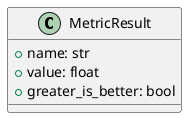

# Module Specification: entities

* **Source Reference:** `src/autogen_team/evaluation/entities.py`

## 1. Architectural Role & Responsibilities
**Purpose:**
Evaluation Domain Entities.

**Responsibilities:**
- [LLM Synthesis Required: Define responsibilities]

**Main Workflow:**
- [LLM Synthesis Required: Define main workflow]

## 2. Dependencies
**Imports:**
- `dataclasses.dataclass`

**Exported Classes:**
- `MetricResult`

**Exported Functions:**

## 3. Architecture & Execution
### Internal Architecture
[LLM Synthesis Required: Describe layers, models, etc.]

### Execution Flow
[LLM Synthesis Required: Describe execution flow]

### Sequence Explanation
[LLM Synthesis Required: Describe sequence]

## 4. UML 2.0 Diagrams
### Class Diagram

## 5. Class & Method Specifications
### `MetricResult` ([`src/autogen_team/evaluation/entities.py`](/src/autogen_team/evaluation/entities.py))
#### Overview
Represents a metric evaluation result.

#### Constructor
**Initialization:** Default constructor. Initializes an empty instance.

#### Attributes
- `name` (`str`): Maintains the state for name.
- `value` (`float`): Maintains the state for value.
- `greater_is_better` (`bool`): Maintains the state for greater_is_better.

#### Methods
## 6. Module Functions