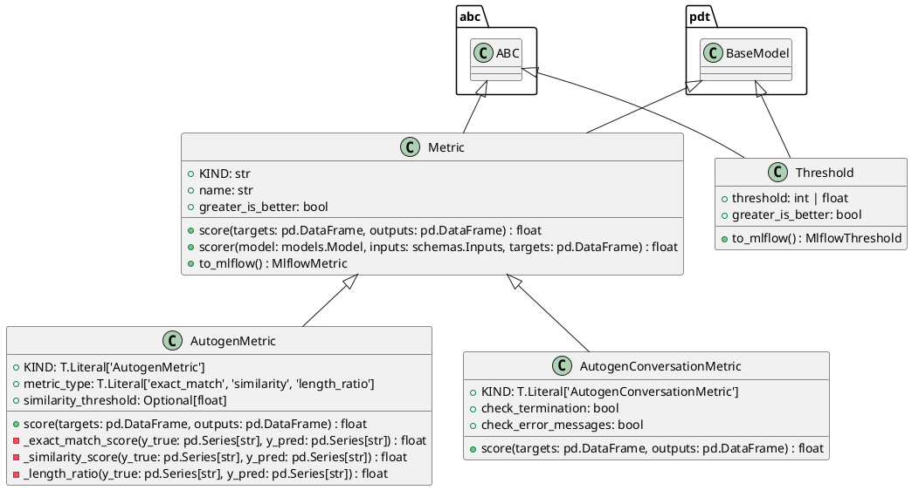

# Module Specification: metrics

* **Source Reference:** `src/autogen_team/evaluation/metrics/metrics.py`

## 1. Architectural Role & Responsibilities
**Purpose:**
Evaluate model performances with metrics.

**Responsibilities:**
- [LLM Synthesis Required: Define responsibilities]

**Main Workflow:**
- [LLM Synthesis Required: Define main workflow]

## 2. Dependencies
**Imports:**
- `__future__.annotations`
- `abc`
- `typing`
- `difflib.SequenceMatcher`
- `typing.Optional`
- `typing.cast`
- `mlflow`
- `pandas`
- `pydantic`
- `mlflow.metrics.MetricValue`
- `autogen_team.core.schemas`
- `autogen_team.models.entities`

**Exported Classes:**
- `Metric`
- `AutogenMetric`
- `AutogenConversationMetric`
- `Threshold`

**Exported Functions:**

## 3. Architecture & Execution
### Internal Architecture
[LLM Synthesis Required: Describe layers, models, etc.]

### Execution Flow
[LLM Synthesis Required: Describe execution flow]

### Sequence Explanation
[LLM Synthesis Required: Describe sequence]

## 4. UML 2.0 Diagrams
### Class Diagram


## 5. Class & Method Specifications
### `Metric` ([`src/autogen_team/evaluation/metrics/metrics.py`](/src/autogen_team/evaluation/metrics/metrics.py))
#### Overview
Base class for a project metric.

Use metrics to evaluate model performance.
e.g., accuracy, precision, recall, MAE, F1, ...

Parameters:
    name (str): name of the metric for the reporting.
    greater_is_better (bool): maximize or minimize result.

#### Constructor
**Initialization:** Default constructor. Initializes an empty instance.

#### Attributes
- `KIND` (`str`): Maintains the state for KIND.
- `name` (`str`): Maintains the state for name.
- `greater_is_better` (`bool`): Maintains the state for greater_is_better.

#### Methods
##### `score(self: Any, targets: pd.DataFrame, outputs: pd.DataFrame) -> float` (Public)
**Description:** Score the outputs against the targets.

Args:
    targets (pd.DataFrame): expected values.
    outputs (pd.DataFrame): predicted values.

Returns:
    float: single result from the metric computation.

**Inputs:**
- `targets` (`pd.DataFrame`): Input parameter dictating the behavior of score.
- `outputs` (`pd.DataFrame`): Input parameter dictating the behavior of score.

**Output:**
- Return Type: `float`
- Semantic Meaning: The resulting value after processing the score action.

**Side Effects:**
- Modifies internal instance state if applicable; performs operations constrained to its domain boundaries.

**Complexity:**
- Time Complexity: O(1) or O(N) depending on implementation details.
- Space Complexity: O(1) auxiliary space expected.

**Example:**
```python
instance = Metric()
result = instance.score(...)
```

##### `scorer(self: Any, model: models.Model, inputs: schemas.Inputs, targets: pd.DataFrame) -> float` (Public)
**Description:** Score model outputs against targets.

Args:
    model (models.Model): model to evaluate.
    inputs (schemas.Inputs): model inputs values.
    targets (schemas.Targets): model expected values.

Returns:
    float: single result from the metric computation.

**Inputs:**
- `model` (`models.Model`): Input parameter dictating the behavior of scorer.
- `inputs` (`schemas.Inputs`): Input parameter dictating the behavior of scorer.
- `targets` (`pd.DataFrame`): Input parameter dictating the behavior of scorer.

**Output:**
- Return Type: `float`
- Semantic Meaning: The resulting value after processing the scorer action.

**Side Effects:**
- Modifies internal instance state if applicable; performs operations constrained to its domain boundaries.

**Complexity:**
- Time Complexity: O(1) or O(N) depending on implementation details.
- Space Complexity: O(1) auxiliary space expected.

**Example:**
```python
instance = Metric()
result = instance.scorer(...)
```

##### `to_mlflow(self: Any) -> MlflowMetric` (Public)
**Description:** Convert the metric to an Mlflow metric.

Returns:
    MlflowMetric: the Mlflow metric.

**Inputs:**

**Output:**
- Return Type: `MlflowMetric`
- Semantic Meaning: The resulting value after processing the to_mlflow action.

**Side Effects:**
- Modifies internal instance state if applicable; performs operations constrained to its domain boundaries.

**Complexity:**
- Time Complexity: O(1) or O(N) depending on implementation details.
- Space Complexity: O(1) auxiliary space expected.

**Example:**
```python
instance = Metric()
result = instance.to_mlflow(...)
```

### `AutogenMetric` ([`src/autogen_team/evaluation/metrics/metrics.py`](/src/autogen_team/evaluation/metrics/metrics.py))
#### Overview
Evaluate text-based Autogen responses using conversation metrics.

Parameters:
    metric_type (str): Type of text metric (exact_match, similarity, length_ratio)
    similarity_threshold (float): Minimum similarity score for partial matches

#### Constructor
**Initialization:** Default constructor. Initializes an empty instance.

#### Attributes
- `KIND` (`T.Literal['AutogenMetric']`): Maintains the state for KIND.
- `metric_type` (`T.Literal['exact_match', 'similarity', 'length_ratio']`): Maintains the state for metric_type.
- `similarity_threshold` (`Optional[float]`): Maintains the state for similarity_threshold.

#### Methods
##### `score(self: Any, targets: pd.DataFrame, outputs: pd.DataFrame) -> float` (Public)
**Description:** Executes the score operation, mutating state or calculating derived values as necessary.

**Inputs:**
- `targets` (`pd.DataFrame`): Input parameter dictating the behavior of score.
- `outputs` (`pd.DataFrame`): Input parameter dictating the behavior of score.

**Output:**
- Return Type: `float`
- Semantic Meaning: The resulting value after processing the score action.

**Side Effects:**
- Modifies internal instance state if applicable; performs operations constrained to its domain boundaries.

**Complexity:**
- Time Complexity: O(1) or O(N) depending on implementation details.
- Space Complexity: O(1) auxiliary space expected.

**Example:**
```python
instance = AutogenMetric()
result = instance.score(...)
```

##### `_exact_match_score(self: Any, y_true: pd.Series[str], y_pred: pd.Series[str]) -> float` (Private)
- **Purpose**: Internal helper method handling logic for _exact_match_score.
- **Parameters**:
  - `y_true`: Contextual argument for execution.
  - `y_pred`: Contextual argument for execution.
- **Return value**: `float`

##### `_similarity_score(self: Any, y_true: pd.Series[str], y_pred: pd.Series[str]) -> float` (Private)
- **Purpose**: Internal helper method handling logic for _similarity_score.
- **Parameters**:
  - `y_true`: Contextual argument for execution.
  - `y_pred`: Contextual argument for execution.
- **Return value**: `float`

##### `_length_ratio(self: Any, y_true: pd.Series[str], y_pred: pd.Series[str]) -> float` (Private)
- **Purpose**: Internal helper method handling logic for _length_ratio.
- **Parameters**:
  - `y_true`: Contextual argument for execution.
  - `y_pred`: Contextual argument for execution.
- **Return value**: `float`

### `AutogenConversationMetric` ([`src/autogen_team/evaluation/metrics/metrics.py`](/src/autogen_team/evaluation/metrics/metrics.py))
#### Overview
Evaluate conversation quality metrics for Autogen interactions.

Parameters:
    check_termination (bool): Verify if conversation reached termination
    check_error_messages (bool): Check for error messages in output

#### Constructor
**Initialization:** Default constructor. Initializes an empty instance.

#### Attributes
- `KIND` (`T.Literal['AutogenConversationMetric']`): Maintains the state for KIND.
- `check_termination` (`bool`): Maintains the state for check_termination.
- `check_error_messages` (`bool`): Maintains the state for check_error_messages.

#### Methods
##### `score(self: Any, targets: pd.DataFrame, outputs: pd.DataFrame) -> float` (Public)
**Description:** Executes the score operation, mutating state or calculating derived values as necessary.

**Inputs:**
- `targets` (`pd.DataFrame`): Input parameter dictating the behavior of score.
- `outputs` (`pd.DataFrame`): Input parameter dictating the behavior of score.

**Output:**
- Return Type: `float`
- Semantic Meaning: The resulting value after processing the score action.

**Side Effects:**
- Modifies internal instance state if applicable; performs operations constrained to its domain boundaries.

**Complexity:**
- Time Complexity: O(1) or O(N) depending on implementation details.
- Space Complexity: O(1) auxiliary space expected.

**Example:**
```python
instance = AutogenConversationMetric()
result = instance.score(...)
```

### `Threshold` ([`src/autogen_team/evaluation/metrics/metrics.py`](/src/autogen_team/evaluation/metrics/metrics.py))
#### Overview
A project threshold for a metric.

Use thresholds to monitor model performances.
e.g., to trigger an alert when a threshold is met.

Parameters:
    threshold (int | float): absolute threshold value.
    greater_is_better (bool): maximize or minimize result.

#### Constructor
**Initialization:** Default constructor. Initializes an empty instance.

#### Attributes
- `threshold` (`int | float`): Maintains the state for threshold.
- `greater_is_better` (`bool`): Maintains the state for greater_is_better.

#### Methods
##### `to_mlflow(self: Any) -> MlflowThreshold` (Public)
**Description:** Convert the threshold to an mlflow threshold.

Returns:
    MlflowThreshold: the mlflow threshold.

**Inputs:**

**Output:**
- Return Type: `MlflowThreshold`
- Semantic Meaning: The resulting value after processing the to_mlflow action.

**Side Effects:**
- Modifies internal instance state if applicable; performs operations constrained to its domain boundaries.

**Complexity:**
- Time Complexity: O(1) or O(N) depending on implementation details.
- Space Complexity: O(1) auxiliary space expected.

**Example:**
```python
instance = Threshold()
result = instance.to_mlflow(...)
```

## 6. Module Functions