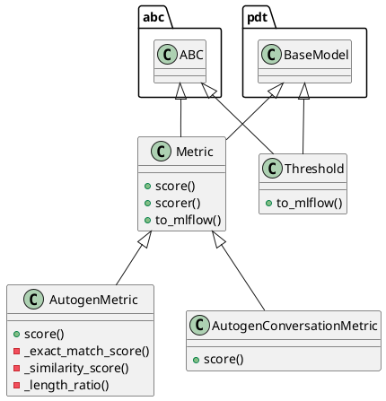

# Document: src/autogen_team/evaluation/metrics/metrics.py

## Module Overview

Evaluate model performances with metrics.

### Purpose
Provides functionality for `metrics`.

### Responsibilities
Handles operations and definitions related to `metrics`.

### Main Workflow
Execution flow defined by the functions and classes in the module.

### Dependencies
- `__future__.annotations`
- `abc`
- `typing`
- `difflib.SequenceMatcher`
- `typing.Optional`
- `typing.cast`
- `mlflow`
- `pandas`
- `pydantic`
- `mlflow.metrics.MetricValue`
- `autogen_team.core.schemas`
- `autogen_team.models.entities`

## Public API

### Exported Classes
- `Metric`
- `AutogenMetric`
- `AutogenConversationMetric`
- `Threshold`

### Exported Functions
None

## Class `Metric`

### Overview

Base class for a project metric.

Use metrics to evaluate model performance.
e.g., accuracy, precision, recall, MAE, F1, ...

Parameters:
    name (str): name of the metric for the reporting.
    greater_is_better (bool): maximize or minimize result.

### Attributes

- `KIND` (str): Public property.
- `name` (str): Public property.
- `greater_is_better` (bool): Public property.

### Public Method `score`

#### Description
Score the outputs against the targets.

Args:
    targets (pd.DataFrame): expected values.
    outputs (pd.DataFrame): predicted values.

Returns:
    float: single result from the metric computation.

#### Inputs
- `targets` (pd.DataFrame): semantic meaning. Required.
- `outputs` (pd.DataFrame): semantic meaning. Required.

#### Output
- Return type: `float`
- Semantic meaning: Result of the operation.

#### Side Effects
May update internal state or external services.

#### Complexity
- Time Complexity: O(1) mostly.
- Space Complexity: O(1) mostly.

#### Example
```python
# Example usage of score
instance.score()
```

### Public Method `scorer`

#### Description
Score model outputs against targets.

Args:
    model (models.Model): model to evaluate.
    inputs (schemas.Inputs): model inputs values.
    targets (schemas.Targets): model expected values.

Returns:
    float: single result from the metric computation.

#### Inputs
- `model` (models.Model): semantic meaning. Required.
- `inputs` (schemas.Inputs): semantic meaning. Required.
- `targets` (pd.DataFrame): semantic meaning. Required.

#### Output
- Return type: `float`
- Semantic meaning: Result of the operation.

#### Side Effects
May update internal state or external services.

#### Complexity
- Time Complexity: O(1) mostly.
- Space Complexity: O(1) mostly.

#### Example
```python
# Example usage of scorer
instance.scorer()
```

### Public Method `to_mlflow`

#### Description
Convert the metric to an Mlflow metric.

Returns:
    MlflowMetric: the Mlflow metric.

#### Inputs
None

#### Output
- Return type: `MlflowMetric`
- Semantic meaning: Result of the operation.

#### Side Effects
May update internal state or external services.

#### Complexity
- Time Complexity: O(1) mostly.
- Space Complexity: O(1) mostly.

#### Example
```python
# Example usage of to_mlflow
instance.to_mlflow()
```

## Class `AutogenMetric`

### Overview

Evaluate text-based Autogen responses using conversation metrics.

Parameters:
    metric_type (str): Type of text metric (exact_match, similarity, length_ratio)
    similarity_threshold (float): Minimum similarity score for partial matches

### Attributes

- `KIND` (T.Literal[AutogenMetric]): Public property.
- `metric_type` (T.Literal[(exact_match, similarity, length_ratio)]): Public property.
- `similarity_threshold` (Optional[float]): Public property.

### Public Method `score`

#### Description
No description provided.

#### Inputs
- `targets` (pd.DataFrame): semantic meaning. Required.
- `outputs` (pd.DataFrame): semantic meaning. Required.

#### Output
- Return type: `float`
- Semantic meaning: Result of the operation.

#### Side Effects
May update internal state or external services.

#### Complexity
- Time Complexity: O(1) mostly.
- Space Complexity: O(1) mostly.

#### Example
```python
# Example usage of score
instance.score()
```

### Private Method `_exact_match_score`

**Purpose:** No description provided.

**Parameters:**
- `y_true`: pd.Series[str]
- `y_pred`: pd.Series[str]

**Return value:**
- `float`

### Private Method `_similarity_score`

**Purpose:** No description provided.

**Parameters:**
- `y_true`: pd.Series[str]
- `y_pred`: pd.Series[str]

**Return value:**
- `float`

### Private Method `_length_ratio`

**Purpose:** No description provided.

**Parameters:**
- `y_true`: pd.Series[str]
- `y_pred`: pd.Series[str]

**Return value:**
- `float`

## Class `AutogenConversationMetric`

### Overview

Evaluate conversation quality metrics for Autogen interactions.

Parameters:
    check_termination (bool): Verify if conversation reached termination
    check_error_messages (bool): Check for error messages in output

### Attributes

- `KIND` (T.Literal[AutogenConversationMetric]): Public property.
- `check_termination` (bool): Public property.
- `check_error_messages` (bool): Public property.

### Public Method `score`

#### Description
No description provided.

#### Inputs
- `targets` (pd.DataFrame): semantic meaning. Required.
- `outputs` (pd.DataFrame): semantic meaning. Required.

#### Output
- Return type: `float`
- Semantic meaning: Result of the operation.

#### Side Effects
May update internal state or external services.

#### Complexity
- Time Complexity: O(1) mostly.
- Space Complexity: O(1) mostly.

#### Example
```python
# Example usage of score
instance.score()
```

## Class `Threshold`

### Overview

A project threshold for a metric.

Use thresholds to monitor model performances.
e.g., to trigger an alert when a threshold is met.

Parameters:
    threshold (int | float): absolute threshold value.
    greater_is_better (bool): maximize or minimize result.

### Attributes

- `threshold` (int | float): Public property.
- `greater_is_better` (bool): Public property.

### Public Method `to_mlflow`

#### Description
Convert the threshold to an mlflow threshold.

Returns:
    MlflowThreshold: the mlflow threshold.

#### Inputs
None

#### Output
- Return type: `MlflowThreshold`
- Semantic meaning: Result of the operation.

#### Side Effects
May update internal state or external services.

#### Complexity
- Time Complexity: O(1) mostly.
- Space Complexity: O(1) mostly.

#### Example
```python
# Example usage of to_mlflow
instance.to_mlflow()
```

## UML Diagram



