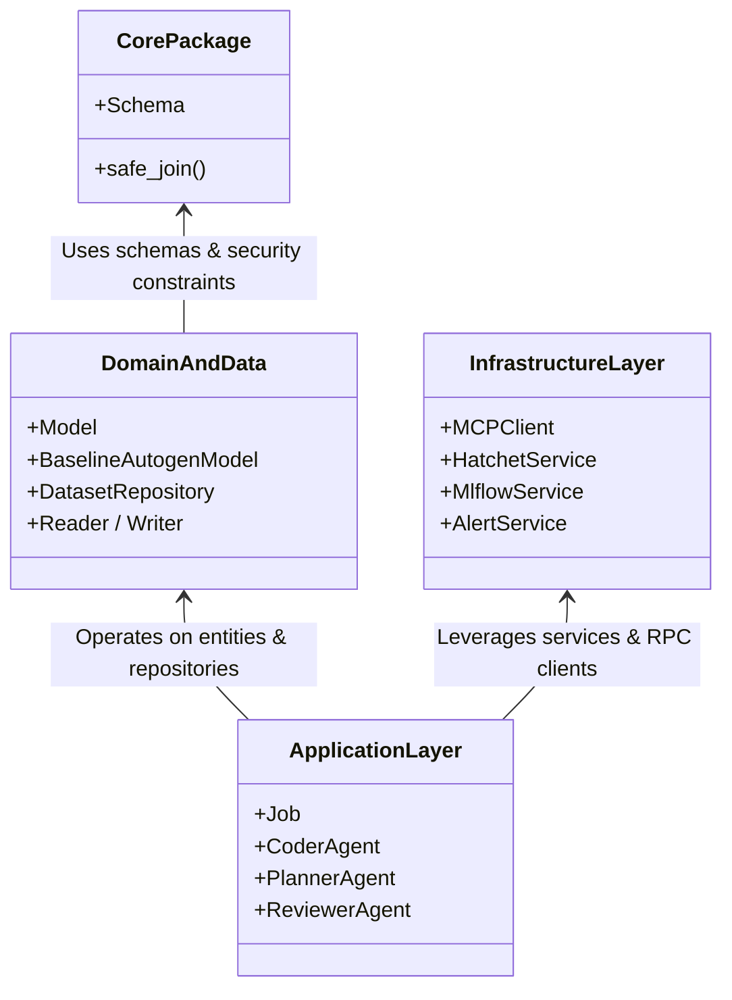
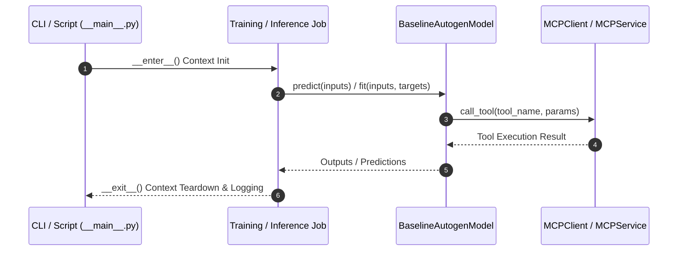

# Package Architecture: autogen_team

* **Source Directory Reference:** `src/autogen_team/`
* **Package Dependency:** Upstream: `pydantic`, `pandera`, `pandas`, `mlflow`, `agent_framework`, `hatchet_sdk`. Downstream: `scripts`, CLI entrypoints, test suites.

## 1. Executive Summary & Purpose

The `autogen_team` package is an enterprise LLMOps and multi-agent workflow orchestration framework. It encapsulates core schemas, multi-agent implementations (Coder, Planner, Reviewer, Tester, Documentation), job lifecycle management (Training, Tuning, Inference, Evaluation, Promotion), model registries, Model Context Protocol (MCP) integrations, and distributed infrastructure services (Kafka messaging, Hatchet orchestration, MLflow tracking).

## 2. UML 2.0 Class & Package Architecture (Deterministic)

The following diagram derived from Pyreverse AST analysis illustrates the primary package boundaries and architectural layers:

## 3. Package & Class Relations

* **Application Layer (`src/autogen_team/application/`):** Contains agent definitions, lifecycle jobs, MCP tool implementations, and mission workflows.
* **Domain & Data Layer (`src/autogen_team/models/`, `src/autogen_team/data_access/`, `src/autogen_team/registry/`):** Defines abstract base models (`Model`, `DatasetRepository`, `RegistryRepository`) and concrete adapters (e.g., `BaselineAutogenModel`, `ParquetReader`, `MlflowAdapter`).
* **Infrastructure Layer (`src/autogen_team/infrastructure/`):** Manages external RPC clients (`MCPClient`), orchestrators (`HatchetService`), tracking (`MlflowService`), messaging (`KafkaApp`, `A2AProtocol`), and sandboxing (`SandboxService`).

## 4. Execution Flow & Runtime Behavior

---

* **Source Citations:**
  * Package Root: `src/autogen_team/__init__.py:1-2`
  * Main Entrypoint: `src/autogen_team/__main__.py:1-8`
  * Settings Configuration: `src/autogen_team/settings.py:1-25`
  * CLI Scripts: `src/autogen_team/scripts.py:1-45`
