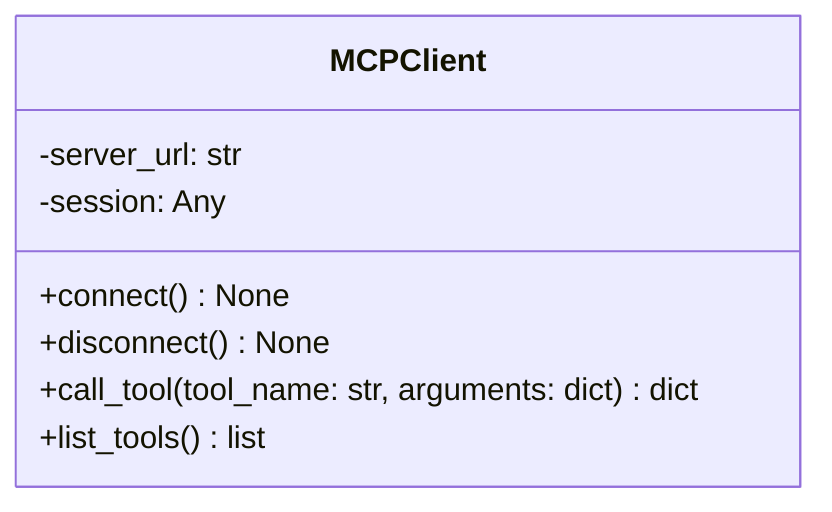
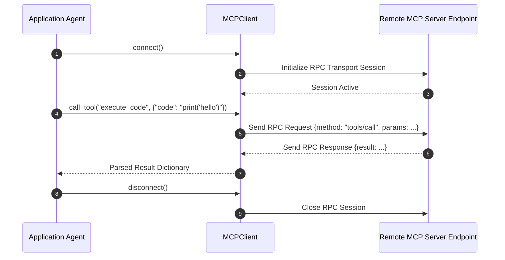

# Module Name: infrastructure/client

* **Source Reference:** `src/autogen_team/infrastructure/client/mcp_client.py`
* **Package Dependency:** Upstream: `asyncio`, `httpx` / `mcp_sdk`. Downstream: `src/autogen_team/application/agents/`.

## 1. Executive Summary & Purpose

The `infrastructure/client` module houses the `MCPClient` class, providing an asynchronous client interface to connect to Model Context Protocol (MCP) servers, inspect tool availability, and execute remote tool calls over JSON-RPC.

## 2. UML 2.0 Class & Client Architecture (Deterministic)

## 3. Package & Class Relations

* **Agent Client Binding:** Instantiated by `CoderAgent`, `PlannerAgent`, `ReviewerAgent`, `TesterAgent`, and `DocumentationAgent` to invoke remote MCP tools asynchronously (`connect`, `call_tool`, `disconnect`).

## 4. Execution Flow & Runtime Behavior

---

* **Source Citations:**
  * MCP Client Implementation: `src/autogen_team/infrastructure/client/mcp_client.py:1-40`
