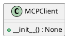

# Module Specification: mcp_client

* **Source Reference:** `src/autogen_team/infrastructure/client/mcp_client.py`

## 1. Architectural Role & Responsibilities
**Purpose:**
MCP Client for connecting to the MCP Server.

**Responsibilities:**
- [LLM Synthesis Required: Define responsibilities]

**Main Workflow:**
- [LLM Synthesis Required: Define main workflow]

## 2. Dependencies
**Imports:**
- `json`
- `os`
- `typing.Any`
- `typing.Dict`
- `typing.Optional`
- `autogen_team.infrastructure.io.osvariables.Env`
- `mcp.ClientSession`
- `mcp.StdioServerParameters`
- `mcp.client.stdio.stdio_client`

**Exported Classes:**
- `MCPClient`

**Exported Functions:**

## 3. Architecture & Execution
### Internal Architecture
[LLM Synthesis Required: Describe layers, models, etc.]

### Execution Flow
[LLM Synthesis Required: Describe execution flow]

### Sequence Explanation
[LLM Synthesis Required: Describe sequence]

## 4. UML 2.0 Diagrams
### Class Diagram


## 5. Class & Method Specifications
### `MCPClient` ([`src/autogen_team/infrastructure/client/mcp_client.py`](/src/autogen_team/infrastructure/client/mcp_client.py))
#### Overview
Client for interacting with the MCP Server.

#### Constructor
**Initialization:** Initialize the MCP Client.

#### Methods
##### `__init__(self: Any) -> None` (Public)
**Description:** Initialize the MCP Client.

**Inputs:**

**Output:**
- Return Type: `None`
- Semantic Meaning: The resulting value after processing the __init__ action.

**Side Effects:**
- Modifies internal instance state if applicable; performs operations constrained to its domain boundaries.

**Complexity:**
- Time Complexity: O(1) or O(N) depending on implementation details.
- Space Complexity: O(1) auxiliary space expected.

**Example:**
```python
instance = MCPClient()
result = instance.__init__(...)
```

## 6. Module Functions