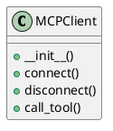

# Document: src/autogen_team/infrastructure/client/mcp_client.py

## Module Overview

MCP Client for connecting to the MCP Server.

### Purpose
Provides functionality for `mcp_client`.

### Responsibilities
Handles operations and definitions related to `mcp_client`.

### Main Workflow
Execution flow defined by the functions and classes in the module.

### Dependencies
- `json`
- `os`
- `typing.Any`
- `typing.Dict`
- `typing.Optional`
- `autogen_team.infrastructure.io.osvariables.Env`
- `mcp.ClientSession`
- `mcp.StdioServerParameters`
- `mcp.client.stdio.stdio_client`

## Public API

### Exported Classes
- `MCPClient`

### Exported Functions
None

## Class `MCPClient`

### Overview

Client for interacting with the MCP Server.

### Constructor

Initialize the MCP Client.

**Parameters:**

### Public Method `connect`

#### Description
Connect to the MCP Server via stdio.

#### Inputs
None

#### Output
- Return type: `None`
- Semantic meaning: Result of the operation.

#### Side Effects
May update internal state or external services.

#### Complexity
- Time Complexity: O(1) mostly.
- Space Complexity: O(1) mostly.

#### Example
```python
# Example usage of connect
instance.connect()
```

### Public Method `disconnect`

#### Description
Disconnect from the MCP Server.

#### Inputs
None

#### Output
- Return type: `None`
- Semantic meaning: Result of the operation.

#### Side Effects
May update internal state or external services.

#### Complexity
- Time Complexity: O(1) mostly.
- Space Complexity: O(1) mostly.

#### Example
```python
# Example usage of disconnect
instance.disconnect()
```

### Public Method `call_tool`

#### Description
Call a tool on the MCP Server.

Args:
    name: The name of the tool to call.
    arguments: The arguments to pass to the tool.

Returns:
    The result of the tool execution.

#### Inputs
- `name` (str): semantic meaning. Required.
- `arguments` (Dict[(str, Any)]): semantic meaning. Required.

#### Output
- Return type: `Any`
- Semantic meaning: Result of the operation.

#### Side Effects
May update internal state or external services.

#### Complexity
- Time Complexity: O(1) mostly.
- Space Complexity: O(1) mostly.

#### Example
```python
# Example usage of call_tool
instance.call_tool()
```

## UML Diagram



