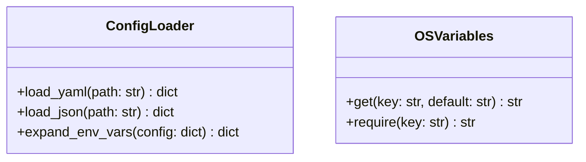

# Module Name: infrastructure/io

* **Source Directory Reference:** `src/autogen_team/infrastructure/io/`
* **Package Dependency:** Upstream: `os`, `yaml`, `json`, `pydantic`. Downstream: `src/autogen_team/infrastructure/services/`.

## 1. Executive Summary & Purpose

The `infrastructure/io` module manages file reading, configuration parsing (YAML/JSON), and environment variable resolution (`osvariables.py`, `configs.py`). It provides variable substitution for strings containing `${VAR_NAME}` placeholders.

## 2. UML 2.0 Class & IO Architecture

## 3. Package & Class Relations

* **Environment Substitution:** Used by `BaselineAutogenModel` and `Settings` to securely resolve API keys, secret strings, and host URLs from system environment variables without hardcoding credentials in repository configuration files.

---

* **Source Citations:**
  * Configs Handler: `src/autogen_team/infrastructure/io/configs.py:1-25`
  * OS Variables Resolver: `src/autogen_team/infrastructure/io/osvariables.py:1-25`
