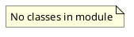

# Document: src/autogen_team/infrastructure/io/configs.py

## Module Overview

Parse, merge, and convert config objects.

### Purpose
Provides functionality for `configs`.

### Responsibilities
Handles operations and definitions related to `configs`.

### Main Workflow
Execution flow defined by the functions and classes in the module.

### Dependencies
- `typing`
- `omegaconf`

## Public API

### Exported Classes
None

### Exported Functions
- `parse_file`
- `parse_string`
- `merge_configs`
- `to_object`

## Public Function `parse_file`

### Description
Parse a config file from a path.

Args:
    path (str): path to local config.

Returns:
    Config: representation of the config file.

### Inputs
- `path` (str): semantic meaning. Required.

### Output
- Return type: `Config`
- Semantic meaning: Result of the operation.

### Side Effects
May update state or affect global resources.

### Complexity
- Time Complexity: O(1) mostly.
- Space Complexity: O(1) mostly.

### Example
```python
# Example usage of parse_file
parse_file()
```

## Public Function `parse_string`

### Description
Parse the given config string.

Args:
    string (str): content of config string.

Returns:
    Config: representation of the config string.

### Inputs
- `string` (str): semantic meaning. Required.

### Output
- Return type: `Config`
- Semantic meaning: Result of the operation.

### Side Effects
May update state or affect global resources.

### Complexity
- Time Complexity: O(1) mostly.
- Space Complexity: O(1) mostly.

### Example
```python
# Example usage of parse_string
parse_string()
```

## Public Function `merge_configs`

### Description
Merge a list of config into a single config.

Args:
    configs (T.Sequence[Config]): list of configs.

Returns:
    Config: representation of the merged config objects.

### Inputs
- `configs` (T.Sequence[Config]): semantic meaning. Required.

### Output
- Return type: `Config`
- Semantic meaning: Result of the operation.

### Side Effects
May update state or affect global resources.

### Complexity
- Time Complexity: O(1) mostly.
- Space Complexity: O(1) mostly.

### Example
```python
# Example usage of merge_configs
merge_configs()
```

## Public Function `to_object`

### Description
Convert a config object to a python object.

Args:
    config (Config): representation of the config.
    resolve (bool): resolve variables. Defaults to True.

Returns:
    object: conversion of the config to a python object.

### Inputs
- `config` (Config): semantic meaning. Required.
- `resolve` (bool): semantic meaning. Optional (default: `True`).

### Output
- Return type: `object`
- Semantic meaning: Result of the operation.

### Side Effects
May update state or affect global resources.

### Complexity
- Time Complexity: O(1) mostly.
- Space Complexity: O(1) mostly.

### Example
```python
# Example usage of to_object
to_object()
```

## UML Diagram


