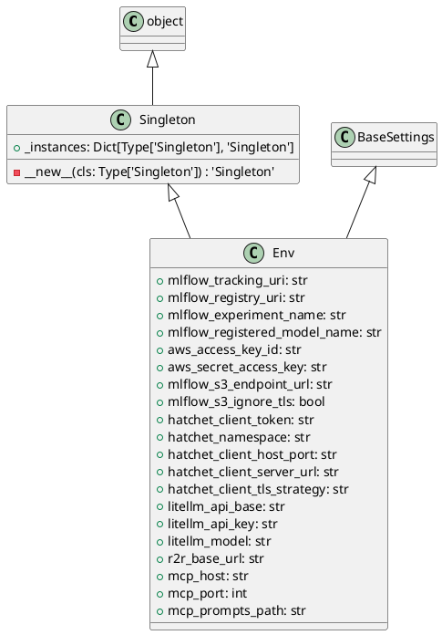

# Module Specification: osvariables

* **Source Reference:** `src/autogen_team/infrastructure/io/osvariables.py`

## 1. Architectural Role & Responsibilities
**Purpose:**
[No description available. LLM synthesis required.]

**Responsibilities:**
- [LLM Synthesis Required: Define responsibilities]

**Main Workflow:**
- [LLM Synthesis Required: Define main workflow]

## 2. Dependencies
**Imports:**
- `typing.Dict`
- `typing.Type`
- `pydantic_settings.BaseSettings`
- `pydantic_settings.SettingsConfigDict`

**Exported Classes:**
- `Singleton`
- `Env`

**Exported Functions:**

## 3. Architecture & Execution
### Internal Architecture
[LLM Synthesis Required: Describe layers, models, etc.]

### Execution Flow
[LLM Synthesis Required: Describe execution flow]

### Sequence Explanation
[LLM Synthesis Required: Describe sequence]

## 4. UML 2.0 Diagrams
### Class Diagram

## 5. Class & Method Specifications
### `Singleton` ([`src/autogen_team/infrastructure/io/osvariables.py`](/src/autogen_team/infrastructure/io/osvariables.py))
#### Overview
The `Singleton` class provides specialized capabilities within the `osvariables` module, coordinating state and behaviors specific to its domain.

#### Constructor
**Initialization:** Default constructor. Initializes an empty instance.

#### Attributes
- `_instances` (`Dict[Type['Singleton'], 'Singleton']`): Maintains the state for _instances.

#### Methods
##### `__new__(cls: Type['Singleton']) -> 'Singleton'` (Private)
- **Purpose**: Internal helper method handling logic for __new__.
- **Parameters**:
  - `cls`: Contextual argument for execution.
- **Return value**: `'Singleton'`

### `Env` ([`src/autogen_team/infrastructure/io/osvariables.py`](/src/autogen_team/infrastructure/io/osvariables.py))
#### Overview
The `Env` class provides specialized capabilities within the `osvariables` module, coordinating state and behaviors specific to its domain.

#### Constructor
**Initialization:** Default constructor. Initializes an empty instance.

#### Attributes
- `mlflow_tracking_uri` (`str`): Maintains the state for mlflow_tracking_uri.
- `mlflow_registry_uri` (`str`): Maintains the state for mlflow_registry_uri.
- `mlflow_experiment_name` (`str`): Maintains the state for mlflow_experiment_name.
- `mlflow_registered_model_name` (`str`): Maintains the state for mlflow_registered_model_name.
- `aws_access_key_id` (`str`): Maintains the state for aws_access_key_id.
- `aws_secret_access_key` (`str`): Maintains the state for aws_secret_access_key.
- `mlflow_s3_endpoint_url` (`str`): Maintains the state for mlflow_s3_endpoint_url.
- `mlflow_s3_ignore_tls` (`bool`): Maintains the state for mlflow_s3_ignore_tls.
- `hatchet_client_token` (`str`): Maintains the state for hatchet_client_token.
- `hatchet_namespace` (`str`): Maintains the state for hatchet_namespace.
- `hatchet_client_host_port` (`str`): Maintains the state for hatchet_client_host_port.
- `hatchet_client_server_url` (`str`): Maintains the state for hatchet_client_server_url.
- `hatchet_client_tls_strategy` (`str`): Maintains the state for hatchet_client_tls_strategy.
- `litellm_api_base` (`str`): Maintains the state for litellm_api_base.
- `litellm_api_key` (`str`): Maintains the state for litellm_api_key.
- `litellm_model` (`str`): Maintains the state for litellm_model.
- `r2r_base_url` (`str`): Maintains the state for r2r_base_url.
- `mcp_host` (`str`): Maintains the state for mcp_host.
- `mcp_port` (`int`): Maintains the state for mcp_port.
- `mcp_prompts_path` (`str`): Maintains the state for mcp_prompts_path.

#### Methods
## 6. Module Functions