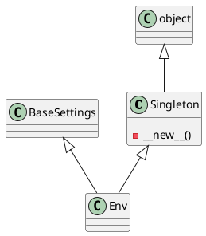

# Document: src/autogen_team/infrastructure/io/osvariables.py

## Module Overview

### Purpose
Provides functionality for `osvariables`.

### Responsibilities
Handles operations and definitions related to `osvariables`.

### Main Workflow
Execution flow defined by the functions and classes in the module.

### Dependencies
- `typing.Dict`
- `typing.Type`
- `pydantic_settings.BaseSettings`
- `pydantic_settings.SettingsConfigDict`

## Public API

### Exported Classes
- `Singleton`
- `Env`

### Exported Functions
None

## Class `Singleton`

### Overview

Represents `Singleton` and provides business capabilities.

### Attributes

### Private Method `__new__`

**Purpose:** No description provided.

**Parameters:**

**Return value:**
- `Singleton`

## Class `Env`

### Overview

Represents `Env` and provides business capabilities.

### Attributes

- `mlflow_tracking_uri` (str): Public property.
- `mlflow_registry_uri` (str): Public property.
- `mlflow_experiment_name` (str): Public property.
- `mlflow_registered_model_name` (str): Public property.
- `aws_access_key_id` (str): Public property.
- `aws_secret_access_key` (str): Public property.
- `mlflow_s3_endpoint_url` (str): Public property.
- `mlflow_s3_ignore_tls` (bool): Public property.
- `hatchet_client_token` (str): Public property.
- `hatchet_namespace` (str): Public property.
- `hatchet_client_host_port` (str): Public property.
- `hatchet_client_server_url` (str): Public property.
- `hatchet_client_tls_strategy` (str): Public property.
- `litellm_api_base` (str): Public property.
- `litellm_api_key` (str): Public property.
- `litellm_model` (str): Public property.
- `r2r_base_url` (str): Public property.
- `mcp_host` (str): Public property.
- `mcp_port` (int): Public property.
- `mcp_prompts_path` (str): Public property.

## UML Diagram

