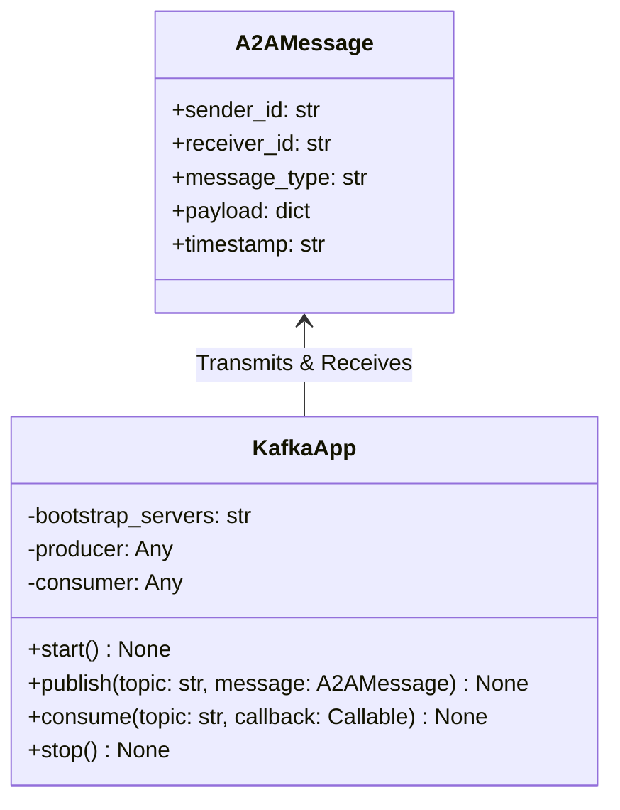
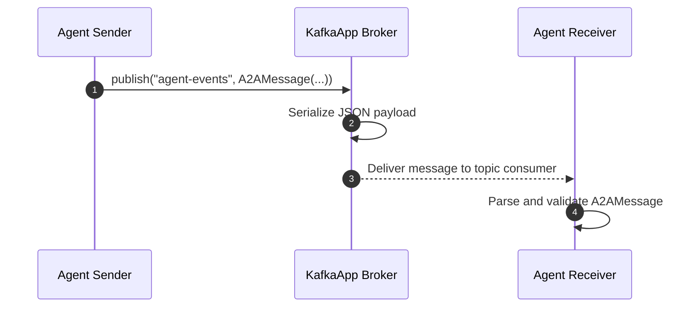

# Module Name: infrastructure/messaging

* **Source Directory Reference:** `src/autogen_team/infrastructure/messaging/`
* **Package Dependency:** Upstream: `aiokafka` / `kafka-python`, `pydantic`. Downstream: Distributed agent runtimes.

## 1. Executive Summary & Purpose

The `infrastructure/messaging` module manages distributed agent message passing via Apache Kafka (`kafka_app.py`) and standardizes inter-agent messaging formats using the Agent-to-Agent protocol (`a2a_protocol.py`).

## 2. UML 2.0 Class & Messaging Architecture (Deterministic)

## 3. Package & Class Relations

* **Protocol Schema (`A2AMessage`):** Enforces Pydantic serialization standards on agent-to-agent payloads, ensuring cross-agent interoperability and schema validation over Kafka topics.
* **Kafka Lifecycle (`KafkaApp`):** Initializes producer and consumer connections, handles message encoding, and gracefully disconnects during system shutdown.

## 4. Execution Flow & Runtime Behavior

---

* **Source Citations:**
  * Agent-to-Agent Protocol: `src/autogen_team/infrastructure/messaging/a2a_protocol.py:1-30`
  * Kafka Application Producer/Consumer: `src/autogen_team/infrastructure/messaging/kafka_app.py:1-40`
