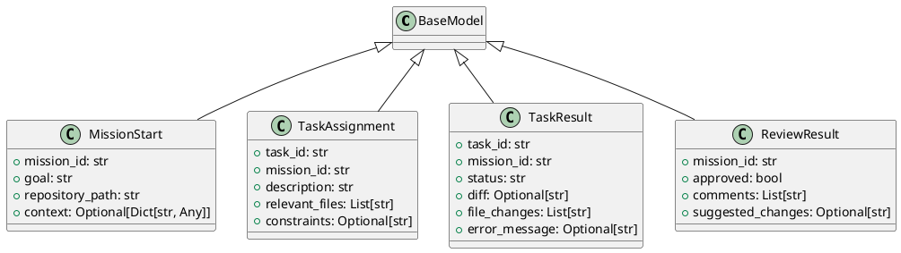

# Module Specification: a2a_protocol

* **Source Reference:** `src/autogen_team/infrastructure/messaging/a2a_protocol.py`

## 1. Architectural Role & Responsibilities
**Purpose:**
[No description available. LLM synthesis required.]

**Responsibilities:**
- [LLM Synthesis Required: Define responsibilities]

**Main Workflow:**
- [LLM Synthesis Required: Define main workflow]

## 2. Dependencies
**Imports:**
- `typing.Any`
- `typing.Dict`
- `typing.List`
- `typing.Optional`
- `pydantic.BaseModel`
- `pydantic.Field`

**Exported Classes:**
- `MissionStart`
- `TaskAssignment`
- `TaskResult`
- `ReviewResult`

**Exported Functions:**

## 3. Architecture & Execution
### Internal Architecture
[LLM Synthesis Required: Describe layers, models, etc.]

### Execution Flow
[LLM Synthesis Required: Describe execution flow]

### Sequence Explanation
[LLM Synthesis Required: Describe sequence]

## 4. UML 2.0 Diagrams
### Class Diagram

## 5. Class & Method Specifications
### `MissionStart` ([`src/autogen_team/infrastructure/messaging/a2a_protocol.py`](/src/autogen_team/infrastructure/messaging/a2a_protocol.py))
#### Overview
Event payload to start a new autonomous mission.

#### Constructor
**Initialization:** Default constructor. Initializes an empty instance.

#### Attributes
- `mission_id` (`str`): Maintains the state for mission_id.
- `goal` (`str`): Maintains the state for goal.
- `repository_path` (`str`): Maintains the state for repository_path.
- `context` (`Optional[Dict[str, Any]]`): Maintains the state for context.

#### Methods
### `TaskAssignment` ([`src/autogen_team/infrastructure/messaging/a2a_protocol.py`](/src/autogen_team/infrastructure/messaging/a2a_protocol.py))
#### Overview
Payload for assigning a task to a Coder Agent.

#### Constructor
**Initialization:** Default constructor. Initializes an empty instance.

#### Attributes
- `task_id` (`str`): Maintains the state for task_id.
- `mission_id` (`str`): Maintains the state for mission_id.
- `description` (`str`): Maintains the state for description.
- `relevant_files` (`List[str]`): Maintains the state for relevant_files.
- `constraints` (`Optional[str]`): Maintains the state for constraints.

#### Methods
### `TaskResult` ([`src/autogen_team/infrastructure/messaging/a2a_protocol.py`](/src/autogen_team/infrastructure/messaging/a2a_protocol.py))
#### Overview
Result from a Coder Agent execution.

#### Constructor
**Initialization:** Default constructor. Initializes an empty instance.

#### Attributes
- `task_id` (`str`): Maintains the state for task_id.
- `mission_id` (`str`): Maintains the state for mission_id.
- `status` (`str`): Maintains the state for status.
- `diff` (`Optional[str]`): Maintains the state for diff.
- `file_changes` (`List[str]`): Maintains the state for file_changes.
- `error_message` (`Optional[str]`): Maintains the state for error_message.

#### Methods
### `ReviewResult` ([`src/autogen_team/infrastructure/messaging/a2a_protocol.py`](/src/autogen_team/infrastructure/messaging/a2a_protocol.py))
#### Overview
Result from a Reviewer Agent.

#### Constructor
**Initialization:** Default constructor. Initializes an empty instance.

#### Attributes
- `mission_id` (`str`): Maintains the state for mission_id.
- `approved` (`bool`): Maintains the state for approved.
- `comments` (`List[str]`): Maintains the state for comments.
- `suggested_changes` (`Optional[str]`): Maintains the state for suggested_changes.

#### Methods
## 6. Module Functions