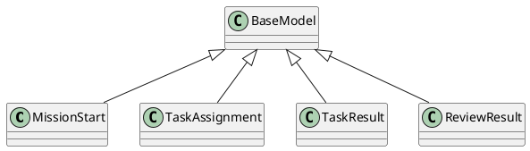

# Document: src/autogen_team/infrastructure/messaging/a2a_protocol.py

## Module Overview

### Purpose
Provides functionality for `a2a_protocol`.

### Responsibilities
Handles operations and definitions related to `a2a_protocol`.

### Main Workflow
Execution flow defined by the functions and classes in the module.

### Dependencies
- `typing.Any`
- `typing.Dict`
- `typing.List`
- `typing.Optional`
- `pydantic.BaseModel`
- `pydantic.Field`

## Public API

### Exported Classes
- `MissionStart`
- `TaskAssignment`
- `TaskResult`
- `ReviewResult`

### Exported Functions
None

## Class `MissionStart`

### Overview

Event payload to start a new autonomous mission.

### Attributes

- `mission_id` (str): Public property.
- `goal` (str): Public property.
- `repository_path` (str): Public property.
- `context` (Optional[Dict[(str, Any)]]): Public property.

## Class `TaskAssignment`

### Overview

Payload for assigning a task to a Coder Agent.

### Attributes

- `task_id` (str): Public property.
- `mission_id` (str): Public property.
- `description` (str): Public property.
- `relevant_files` (List[str]): Public property.
- `constraints` (Optional[str]): Public property.

## Class `TaskResult`

### Overview

Result from a Coder Agent execution.

### Attributes

- `task_id` (str): Public property.
- `mission_id` (str): Public property.
- `status` (str): Public property.
- `diff` (Optional[str]): Public property.
- `file_changes` (List[str]): Public property.
- `error_message` (Optional[str]): Public property.

## Class `ReviewResult`

### Overview

Result from a Reviewer Agent.

### Attributes

- `mission_id` (str): Public property.
- `approved` (bool): Public property.
- `comments` (List[str]): Public property.
- `suggested_changes` (Optional[str]): Public property.

## UML Diagram

