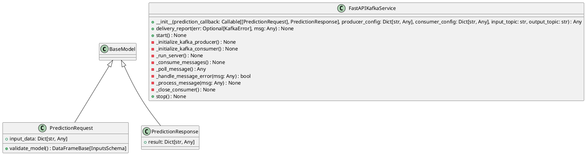

# Module Specification: kafka_app

* **Source Reference:** `src/autogen_team/infrastructure/messaging/kafka_app.py`

## 1. Architectural Role & Responsibilities
**Purpose:**
FastAPI and Kafka Service for Predictions with Logging.

**Responsibilities:**
- [LLM Synthesis Required: Define responsibilities]

**Main Workflow:**
- [LLM Synthesis Required: Define main workflow]

## 2. Dependencies
**Imports:**
- `json`
- `logging`
- `os`
- `signal`
- `sys`
- `threading`
- `time`
- `typing.Any`
- `typing.Callable`
- `typing.Dict`
- `typing.Optional`
- `pandas`
- `uvicorn`
- `confluent_kafka.Consumer`
- `confluent_kafka.KafkaError`
- `confluent_kafka.Producer`
- `fastapi.FastAPI`
- `pandera.typing.common.DataFrameBase`
- `pydantic.BaseModel`
- `autogen_team.infrastructure.io`
- `autogen_team.core.schemas.InputsSchema`
- `autogen_team.core.schemas.Outputs`
- `autogen_team.infrastructure.services`
- `autogen_team.registry.adapters.mlflow_adapter.CustomLoader`
- `types`
- `autogen_team.registry`
- `autogen_team.registry.adapters.mlflow_adapter.CustomSaver`
- `autogen_team.models`

**Exported Classes:**
- `PredictionRequest`
- `PredictionResponse`
- `FastAPIKafkaService`

**Exported Functions:**
- `main`

## 3. Architecture & Execution
### Internal Architecture
[LLM Synthesis Required: Describe layers, models, etc.]

### Execution Flow
[LLM Synthesis Required: Describe execution flow]

### Sequence Explanation
[LLM Synthesis Required: Describe sequence]

## 4. UML 2.0 Diagrams
### Class Diagram


## 5. Class & Method Specifications
### `PredictionRequest` ([`src/autogen_team/infrastructure/messaging/kafka_app.py`](/src/autogen_team/infrastructure/messaging/kafka_app.py))
#### Overview
Request model for prediction.

#### Constructor
**Initialization:** Default constructor. Initializes an empty instance.

#### Attributes
- `input_data` (`Dict[str, Any]`): Maintains the state for input_data.

#### Methods
##### `validate_model(self: Any) -> DataFrameBase[InputsSchema]` (Public)
**Description:** Validates the input data against InputsSchema.

**Inputs:**

**Output:**
- Return Type: `DataFrameBase[InputsSchema]`
- Semantic Meaning: The resulting value after processing the validate_model action.

**Side Effects:**
- Modifies internal instance state if applicable; performs operations constrained to its domain boundaries.

**Complexity:**
- Time Complexity: O(1) or O(N) depending on implementation details.
- Space Complexity: O(1) auxiliary space expected.

**Example:**
```python
instance = PredictionRequest()
result = instance.validate_model(...)
```

### `PredictionResponse` ([`src/autogen_team/infrastructure/messaging/kafka_app.py`](/src/autogen_team/infrastructure/messaging/kafka_app.py))
#### Overview
Response model for prediction.

#### Constructor
**Initialization:** Default constructor. Initializes an empty instance.

#### Attributes
- `result` (`Dict[str, Any]`): Maintains the state for result.

#### Methods
### `FastAPIKafkaService` ([`src/autogen_team/infrastructure/messaging/kafka_app.py`](/src/autogen_team/infrastructure/messaging/kafka_app.py))
#### Overview
Service for deploying a FastAPI application with a Kafka producer and consumer.

#### Constructor
**Initialization:** Initializes `FastAPIKafkaService` with required dependencies and sets up initial internal state.

#### Methods
##### `__init__(self: Any, prediction_callback: Callable[[PredictionRequest], PredictionResponse], producer_config: Dict[str, Any], consumer_config: Dict[str, Any], input_topic: str, output_topic: str) -> Any` (Public)
**Description:** Executes the __init__ operation, mutating state or calculating derived values as necessary.

**Inputs:**
- `prediction_callback` (`Callable[[PredictionRequest], PredictionResponse]`): Input parameter dictating the behavior of __init__.
- `producer_config` (`Dict[str, Any]`): Input parameter dictating the behavior of __init__.
- `consumer_config` (`Dict[str, Any]`): Input parameter dictating the behavior of __init__.
- `input_topic` (`str`): Input parameter dictating the behavior of __init__.
- `output_topic` (`str`): Input parameter dictating the behavior of __init__.

**Output:**
- Return Type: `Any`
- Semantic Meaning: The resulting value after processing the __init__ action.

**Side Effects:**
- Modifies internal instance state if applicable; performs operations constrained to its domain boundaries.

**Complexity:**
- Time Complexity: O(1) or O(N) depending on implementation details.
- Space Complexity: O(1) auxiliary space expected.

**Example:**
```python
instance = FastAPIKafkaService()
result = instance.__init__(...)
```

##### `delivery_report(self: Any, err: Optional[KafkaError], msg: Any) -> None` (Public)
**Description:** Called once for each message produced to indicate delivery result.

**Inputs:**
- `err` (`Optional[KafkaError]`): Input parameter dictating the behavior of delivery_report.
- `msg` (`Any`): Input parameter dictating the behavior of delivery_report.

**Output:**
- Return Type: `None`
- Semantic Meaning: The resulting value after processing the delivery_report action.

**Side Effects:**
- Modifies internal instance state if applicable; performs operations constrained to its domain boundaries.

**Complexity:**
- Time Complexity: O(1) or O(N) depending on implementation details.
- Space Complexity: O(1) auxiliary space expected.

**Example:**
```python
instance = FastAPIKafkaService()
result = instance.delivery_report(...)
```

##### `start(self: Any) -> None` (Public)
**Description:** Start the FastAPI application and Kafka consumer.

**Inputs:**

**Output:**
- Return Type: `None`
- Semantic Meaning: The resulting value after processing the start action.

**Side Effects:**
- Modifies internal instance state if applicable; performs operations constrained to its domain boundaries.

**Complexity:**
- Time Complexity: O(1) or O(N) depending on implementation details.
- Space Complexity: O(1) auxiliary space expected.

**Example:**
```python
instance = FastAPIKafkaService()
result = instance.start(...)
```

##### `_initialize_kafka_producer(self: Any) -> None` (Private)
- **Purpose**: Initialize Kafka producer.
- **Parameters**:
- **Return value**: `None`

##### `_initialize_kafka_consumer(self: Any) -> None` (Private)
- **Purpose**: Initialize Kafka consumer.
- **Parameters**:
- **Return value**: `None`

##### `_run_server(self: Any) -> None` (Private)
- **Purpose**: Run the FastAPI server.
- **Parameters**:
- **Return value**: `None`

##### `_consume_messages(self: Any) -> None` (Private)
- **Purpose**: Consume messages from Kafka topic and produce predictions.
- **Parameters**:
- **Return value**: `None`

##### `_poll_message(self: Any) -> Any` (Private)
- **Purpose**: Poll message from Kafka consumer.
- **Parameters**:
- **Return value**: `Any`

##### `_handle_message_error(self: Any, msg: Any) -> bool` (Private)
- **Purpose**: Handle errors in polled messages.
- **Parameters**:
  - `msg`: Contextual argument for execution.
- **Return value**: `bool`

##### `_process_message(self: Any, msg: Any) -> None` (Private)
- **Purpose**: Process a valid Kafka message.
- **Parameters**:
  - `msg`: Contextual argument for execution.
- **Return value**: `None`

##### `_close_consumer(self: Any) -> None` (Private)
- **Purpose**: Close the Kafka consumer.
- **Parameters**:
- **Return value**: `None`

##### `stop(self: Any) -> None` (Public)
**Description:** Stop the FastAPI application and Kafka consumer.

**Inputs:**

**Output:**
- Return Type: `None`
- Semantic Meaning: The resulting value after processing the stop action.

**Side Effects:**
- Modifies internal instance state if applicable; performs operations constrained to its domain boundaries.

**Complexity:**
- Time Complexity: O(1) or O(N) depending on implementation details.
- Space Complexity: O(1) auxiliary space expected.

**Example:**
```python
instance = FastAPIKafkaService()
result = instance.stop(...)
```

## 6. Module Functions
### `main() -> None`
**Description:** Standalone module function that executes the main workflow.

**Inputs:**

**Output:**
- Return Type: `None`

**Side Effects:**
- Operations execute statelessly or affect module-level configuration.

**Example:**
```python
result = main(...)
```
