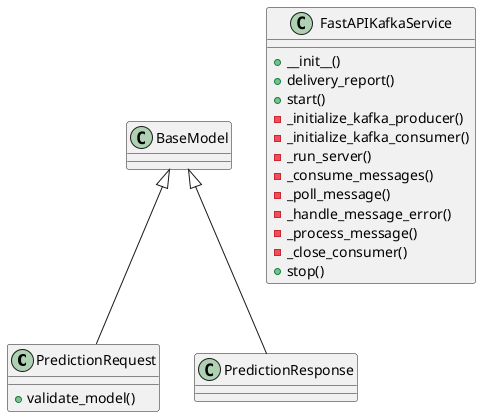

# Document: src/autogen_team/infrastructure/messaging/kafka_app.py

## Module Overview

FastAPI and Kafka Service for Predictions with Logging.

### Purpose
Provides functionality for `kafka_app`.

### Responsibilities
Handles operations and definitions related to `kafka_app`.

### Main Workflow
Execution flow defined by the functions and classes in the module.

### Dependencies
- `json`
- `logging`
- `os`
- `signal`
- `sys`
- `threading`
- `time`
- `typing.Any`
- `typing.Callable`
- `typing.Dict`
- `typing.Optional`
- `pandas`
- `uvicorn`
- `confluent_kafka.Consumer`
- `confluent_kafka.KafkaError`
- `confluent_kafka.Producer`
- `fastapi.FastAPI`
- `pandera.typing.common.DataFrameBase`
- `pydantic.BaseModel`
- `autogen_team.infrastructure.io`
- `autogen_team.core.schemas.InputsSchema`
- `autogen_team.core.schemas.Outputs`
- `autogen_team.infrastructure.services`
- `autogen_team.registry.adapters.mlflow_adapter.CustomLoader`
- `types`
- `autogen_team.registry`
- `autogen_team.registry.adapters.mlflow_adapter.CustomSaver`
- `autogen_team.models`

## Public API

### Exported Classes
- `PredictionRequest`
- `PredictionResponse`
- `FastAPIKafkaService`

### Exported Functions
- `health_check`
- `main`

## Class `PredictionRequest`

### Overview

Request model for prediction.

### Attributes

- `input_data` (Dict[(str, Any)]): Public property.

### Public Method `validate_model`

#### Description
Validates the input data against InputsSchema.

#### Inputs
None

#### Output
- Return type: `DataFrameBase[InputsSchema]`
- Semantic meaning: Result of the operation.

#### Side Effects
May update internal state or external services.

#### Complexity
- Time Complexity: O(1) mostly.
- Space Complexity: O(1) mostly.

#### Example
```python
# Example usage of validate_model
instance.validate_model()
```

## Class `PredictionResponse`

### Overview

Response model for prediction.

### Attributes

- `result` (Dict[(str, Any)]): Public property.

## Class `FastAPIKafkaService`

### Overview

Service for deploying a FastAPI application with a Kafka producer and consumer.

### Constructor

No description provided.

**Parameters:**
- `prediction_callback` (Callable[([PredictionRequest], PredictionResponse)])
- `producer_config` (Dict[(str, Any)])
- `consumer_config` (Dict[(str, Any)])
- `input_topic` (str)
- `output_topic` (str)

### Public Method `delivery_report`

#### Description
Called once for each message produced to indicate delivery result.

#### Inputs
- `err` (Optional[KafkaError]): semantic meaning. Required.
- `msg` (Any): semantic meaning. Required.

#### Output
- Return type: `None`
- Semantic meaning: Result of the operation.

#### Side Effects
May update internal state or external services.

#### Complexity
- Time Complexity: O(1) mostly.
- Space Complexity: O(1) mostly.

#### Example
```python
# Example usage of delivery_report
instance.delivery_report()
```

### Public Method `start`

#### Description
Start the FastAPI application and Kafka consumer.

#### Inputs
None

#### Output
- Return type: `None`
- Semantic meaning: Result of the operation.

#### Side Effects
May update internal state or external services.

#### Complexity
- Time Complexity: O(1) mostly.
- Space Complexity: O(1) mostly.

#### Example
```python
# Example usage of start
instance.start()
```

### Private Method `_initialize_kafka_producer`

**Purpose:** Initialize Kafka producer.

**Parameters:**

**Return value:**
- `None`

### Private Method `_initialize_kafka_consumer`

**Purpose:** Initialize Kafka consumer.

**Parameters:**

**Return value:**
- `None`

### Private Method `_run_server`

**Purpose:** Run the FastAPI server.

**Parameters:**

**Return value:**
- `None`

### Private Method `_consume_messages`

**Purpose:** Consume messages from Kafka topic and produce predictions.

**Parameters:**

**Return value:**
- `None`

### Private Method `_poll_message`

**Purpose:** Poll message from Kafka consumer.

**Parameters:**

**Return value:**
- `Any`

### Private Method `_handle_message_error`

**Purpose:** Handle errors in polled messages.

**Parameters:**
- `msg`: Any

**Return value:**
- `bool`

### Private Method `_process_message`

**Purpose:** Process a valid Kafka message.

**Parameters:**
- `msg`: Any

**Return value:**
- `None`

### Private Method `_close_consumer`

**Purpose:** Close the Kafka consumer.

**Parameters:**

**Return value:**
- `None`

### Public Method `stop`

#### Description
Stop the FastAPI application and Kafka consumer.

#### Inputs
None

#### Output
- Return type: `None`
- Semantic meaning: Result of the operation.

#### Side Effects
May update internal state or external services.

#### Complexity
- Time Complexity: O(1) mostly.
- Space Complexity: O(1) mostly.

#### Example
```python
# Example usage of stop
instance.stop()
```

## Public Function `health_check`

### Description
Simple health check endpoint to verify that the service is running.

### Inputs
None

### Output
- Return type: `Dict[(str, str)]`
- Semantic meaning: Result of the operation.

### Side Effects
May update state or affect global resources.

### Complexity
- Time Complexity: O(1) mostly.
- Space Complexity: O(1) mostly.

### Example
```python
# Example usage of health_check
health_check()
```

## Public Function `main`

### Description
No description provided.

### Inputs
None

### Output
- Return type: `None`
- Semantic meaning: Result of the operation.

### Side Effects
May update state or affect global resources.

### Complexity
- Time Complexity: O(1) mostly.
- Space Complexity: O(1) mostly.

### Example
```python
# Example usage of main
main()
```

## UML Diagram


