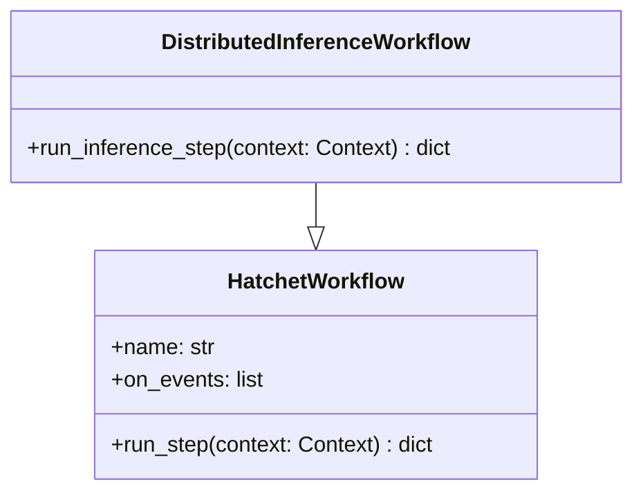

# Module Name: infrastructure/orchestration

* **Source Directory Reference:** `src/autogen_team/infrastructure/orchestration/`
* **Package Dependency:** Upstream: `hatchet_sdk`. Downstream: `src/autogen_team/application/jobs/hatchet_inference.py`.

## 1. Executive Summary & Purpose

The `infrastructure/orchestration` module provides integration with the Hatchet distributed workflow engine (`hatchet_workflows.py`). It defines DAG workflows for background inference, multi-agent training pipelines, and task concurrency controls.

## 2. UML 2.0 Class & Orchestration Architecture

## 3. Package & Class Relations

* **Workflow Triggering:** Executed via `HatchetService` in response to scheduled jobs or asynchronous events. Enables distributed fault tolerance, step retries, and real-time execution monitoring.

---

* **Source Citations:**
  * Hatchet Workflows: `src/autogen_team/infrastructure/orchestration/hatchet_workflows.py:1-35`
