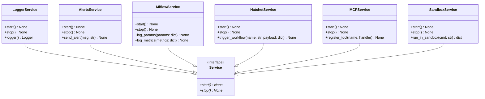
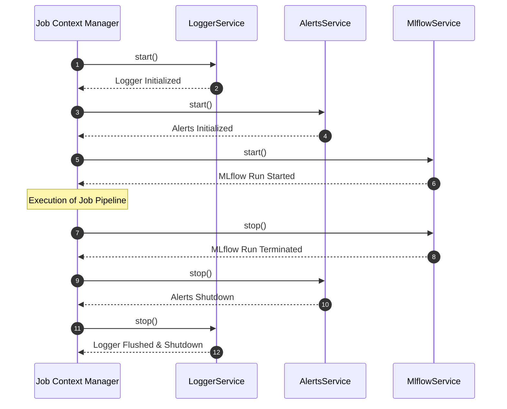

# Module Name: infrastructure/services

* **Source Directory Reference:** `src/autogen_team/infrastructure/services/`
* **Package Dependency:** Upstream: `pydantic`, `loguru`, `mlflow`, `hatchet_sdk`. Downstream: `src/autogen_team/application/jobs/base.py`.

## 1. Executive Summary & Purpose

The `infrastructure/services` module defines the lifecycle managers for system-wide infrastructure services: `LoggerService`, `AlertsService`, `MlflowService`, `HatchetService`, `MCPService`, and `SandboxService`. Each service implements start/stop lifecycle methods and is managed inside `Job.__enter__()`/`__exit__()` context blocks.

## 2. UML 2.0 Class & Inheritance Architecture (Deterministic)

## 3. Package & Class Relations

* **Service Injection (`Job` Base Class):** Default instances of `LoggerService`, `AlertsService`, and `MlflowService` are instantiated as frozen Pydantic fields on `Job`, ensuring consistent logging, alerting, and experiment tracking across all execution runs.
* **Sandbox & MCP Isolation:** `SandboxService` provides code execution isolation for `ExecuteCodeTool`, while `MCPService` handles tool registration and RPC routing.

## 4. Execution Flow & Runtime Behavior

---

* **Source Citations:**
  * Logger Service: `src/autogen_team/infrastructure/services/logger_service.py:1-35`
  * Alert Service: `src/autogen_team/infrastructure/services/alert_service.py:1-35`
  * MLflow Service: `src/autogen_team/infrastructure/services/mlflow_service.py:1-35`
  * Hatchet Service: `src/autogen_team/infrastructure/services/hatchet_service.py:1-35`
  * MCP Service: `src/autogen_team/infrastructure/services/mcp_service.py:1-35`
  * Sandbox Service: `src/autogen_team/infrastructure/services/sandbox_service.py:1-35`
