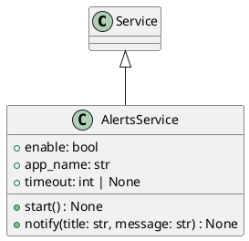

# Module Specification: alert_service

* **Source Reference:** `src/autogen_team/infrastructure/services/alert_service.py`

## 1. Architectural Role & Responsibilities
**Purpose:**
Alert Service - System notifications.

**Responsibilities:**
- [LLM Synthesis Required: Define responsibilities]

**Main Workflow:**
- [LLM Synthesis Required: Define main workflow]

## 2. Dependencies
**Imports:**
- `__future__.annotations`
- `plyer.notification`
- `logger_service.Service`

**Exported Classes:**
- `AlertsService`

**Exported Functions:**

## 3. Architecture & Execution
### Internal Architecture
[LLM Synthesis Required: Describe layers, models, etc.]

### Execution Flow
[LLM Synthesis Required: Describe execution flow]

### Sequence Explanation
[LLM Synthesis Required: Describe sequence]

## 4. UML 2.0 Diagrams
### Class Diagram


## 5. Class & Method Specifications
### `AlertsService` ([`src/autogen_team/infrastructure/services/alert_service.py`](/src/autogen_team/infrastructure/services/alert_service.py))
#### Overview
Service for sending notifications.

#### Constructor
**Initialization:** Default constructor. Initializes an empty instance.

#### Attributes
- `enable` (`bool`): Maintains the state for enable.
- `app_name` (`str`): Maintains the state for app_name.
- `timeout` (`int | None`): Maintains the state for timeout.

#### Methods
##### `start(self: Any) -> None` (Public)
**Description:** Executes the start operation, mutating state or calculating derived values as necessary.

**Inputs:**

**Output:**
- Return Type: `None`
- Semantic Meaning: The resulting value after processing the start action.

**Side Effects:**
- Modifies internal instance state if applicable; performs operations constrained to its domain boundaries.

**Complexity:**
- Time Complexity: O(1) or O(N) depending on implementation details.
- Space Complexity: O(1) auxiliary space expected.

**Example:**
```python
instance = AlertsService()
result = instance.start(...)
```

##### `notify(self: Any, title: str, message: str) -> None` (Public)
**Description:** Send a notification to the system.

**Inputs:**
- `title` (`str`): Input parameter dictating the behavior of notify.
- `message` (`str`): Input parameter dictating the behavior of notify.

**Output:**
- Return Type: `None`
- Semantic Meaning: The resulting value after processing the notify action.

**Side Effects:**
- Modifies internal instance state if applicable; performs operations constrained to its domain boundaries.

**Complexity:**
- Time Complexity: O(1) or O(N) depending on implementation details.
- Space Complexity: O(1) auxiliary space expected.

**Example:**
```python
instance = AlertsService()
result = instance.notify(...)
```

## 6. Module Functions