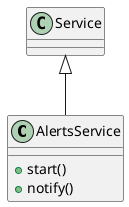

# Document: src/autogen_team/infrastructure/services/alert_service.py

## Module Overview

Alert Service - System notifications.

### Purpose
Provides functionality for `alert_service`.

### Responsibilities
Handles operations and definitions related to `alert_service`.

### Main Workflow
Execution flow defined by the functions and classes in the module.

### Dependencies
- `__future__.annotations`
- `plyer.notification`
- `logger_service.Service`

## Public API

### Exported Classes
- `AlertsService`

### Exported Functions
None

## Class `AlertsService`

### Overview

Service for sending notifications.

### Attributes

- `enable` (bool): Public property.
- `app_name` (str): Public property.
- `timeout` (int | None): Public property.

### Public Method `start`

#### Description
No description provided.

#### Inputs
None

#### Output
- Return type: `None`
- Semantic meaning: Result of the operation.

#### Side Effects
May update internal state or external services.

#### Complexity
- Time Complexity: O(1) mostly.
- Space Complexity: O(1) mostly.

#### Example
```python
# Example usage of start
instance.start()
```

### Public Method `notify`

#### Description
Send a notification to the system.

#### Inputs
- `title` (str): semantic meaning. Required.
- `message` (str): semantic meaning. Required.

#### Output
- Return type: `None`
- Semantic meaning: Result of the operation.

#### Side Effects
May update internal state or external services.

#### Complexity
- Time Complexity: O(1) mostly.
- Space Complexity: O(1) mostly.

#### Example
```python
# Example usage of notify
instance.notify()
```

## UML Diagram



