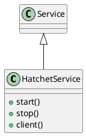

# Document: src/autogen_team/infrastructure/services/hatchet_service.py

## Module Overview

Hatchet Service - Task Orchestration.

### Purpose
Provides functionality for `hatchet_service`.

### Responsibilities
Handles operations and definitions related to `hatchet_service`.

### Main Workflow
Execution flow defined by the functions and classes in the module.

### Dependencies
- `__future__.annotations`
- `typing.Any`
- `typing.ClassVar`
- `hatchet_sdk.Hatchet`
- `pydantic.Field`
- `autogen_team.infrastructure.io.osvariables.Env`
- `logger_service.Service`

## Public API

### Exported Classes
- `HatchetService`

### Exported Functions
None

## Class `HatchetService`

### Overview

Service for Hatchet task orchestration.

### Attributes

- `env` (ClassVar[Env]): Public property.
- `token` (str): Public property.
- `namespace` (str): Public property.

### Public Method `start`

#### Description
Initialize the Hatchet client.

#### Inputs
None

#### Output
- Return type: `None`
- Semantic meaning: Result of the operation.

#### Side Effects
May update internal state or external services.

#### Complexity
- Time Complexity: O(1) mostly.
- Space Complexity: O(1) mostly.

#### Example
```python
# Example usage of start
instance.start()
```

### Public Method `stop`

#### Description
Stop the Hatchet service.

#### Inputs
None

#### Output
- Return type: `None`
- Semantic meaning: Result of the operation.

#### Side Effects
May update internal state or external services.

#### Complexity
- Time Complexity: O(1) mostly.
- Space Complexity: O(1) mostly.

#### Example
```python
# Example usage of stop
instance.stop()
```

### Public Method `client`

#### Description
Return the Hatchet client.

#### Inputs
None

#### Output
- Return type: `Hatchet`
- Semantic meaning: Result of the operation.

#### Side Effects
May update internal state or external services.

#### Complexity
- Time Complexity: O(1) mostly.
- Space Complexity: O(1) mostly.

#### Example
```python
# Example usage of client
instance.client()
```

## UML Diagram



