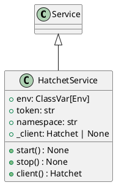

# Module Specification: hatchet_service

* **Source Reference:** `src/autogen_team/infrastructure/services/hatchet_service.py`

## 1. Architectural Role & Responsibilities
**Purpose:**
Hatchet Service - Task Orchestration.

**Responsibilities:**
- [LLM Synthesis Required: Define responsibilities]

**Main Workflow:**
- [LLM Synthesis Required: Define main workflow]

## 2. Dependencies
**Imports:**
- `__future__.annotations`
- `typing.Any`
- `typing.ClassVar`
- `hatchet_sdk.Hatchet`
- `pydantic.Field`
- `autogen_team.infrastructure.io.osvariables.Env`
- `logger_service.Service`

**Exported Classes:**
- `HatchetService`

**Exported Functions:**

## 3. Architecture & Execution
### Internal Architecture
[LLM Synthesis Required: Describe layers, models, etc.]

### Execution Flow
[LLM Synthesis Required: Describe execution flow]

### Sequence Explanation
[LLM Synthesis Required: Describe sequence]

## 4. UML 2.0 Diagrams
### Class Diagram


## 5. Class & Method Specifications
### `HatchetService` ([`src/autogen_team/infrastructure/services/hatchet_service.py`](/src/autogen_team/infrastructure/services/hatchet_service.py))
#### Overview
Service for Hatchet task orchestration.

#### Constructor
**Initialization:** Default constructor. Initializes an empty instance.

#### Attributes
- `env` (`ClassVar[Env]`): Maintains the state for env.
- `token` (`str`): Maintains the state for token.
- `namespace` (`str`): Maintains the state for namespace.
- `_client` (`Hatchet | None`): Maintains the state for _client.

#### Methods
##### `start(self: Any) -> None` (Public)
**Description:** Initialize the Hatchet client.

**Inputs:**

**Output:**
- Return Type: `None`
- Semantic Meaning: The resulting value after processing the start action.

**Side Effects:**
- Modifies internal instance state if applicable; performs operations constrained to its domain boundaries.

**Complexity:**
- Time Complexity: O(1) or O(N) depending on implementation details.
- Space Complexity: O(1) auxiliary space expected.

**Example:**
```python
instance = HatchetService()
result = instance.start(...)
```

##### `stop(self: Any) -> None` (Public)
**Description:** Stop the Hatchet service.

**Inputs:**

**Output:**
- Return Type: `None`
- Semantic Meaning: The resulting value after processing the stop action.

**Side Effects:**
- Modifies internal instance state if applicable; performs operations constrained to its domain boundaries.

**Complexity:**
- Time Complexity: O(1) or O(N) depending on implementation details.
- Space Complexity: O(1) auxiliary space expected.

**Example:**
```python
instance = HatchetService()
result = instance.stop(...)
```

##### `client(self: Any) -> Hatchet` (Public)
**Description:** Return the Hatchet client.

**Inputs:**

**Output:**
- Return Type: `Hatchet`
- Semantic Meaning: The resulting value after processing the client action.

**Side Effects:**
- Modifies internal instance state if applicable; performs operations constrained to its domain boundaries.

**Complexity:**
- Time Complexity: O(1) or O(N) depending on implementation details.
- Space Complexity: O(1) auxiliary space expected.

**Example:**
```python
instance = HatchetService()
result = instance.client(...)
```

## 6. Module Functions