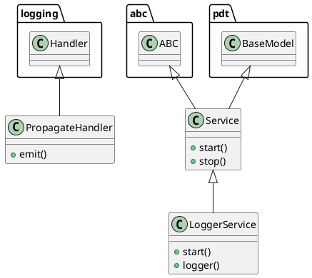

# Document: src/autogen_team/infrastructure/services/logger_service.py

## Module Overview

Logger Service - Logging with OpenTelemetry.

### Purpose
Provides functionality for `logger_service`.

### Responsibilities
Handles operations and definitions related to `logger_service`.

### Main Workflow
Execution flow defined by the functions and classes in the module.

### Dependencies
- `__future__.annotations`
- `abc`
- `logging`
- `sys`
- `loguru`
- `pydantic`
- `opentelemetry.trace`
- `opentelemetry._logs.set_logger_provider`
- `opentelemetry.exporter.otlp.proto.http._log_exporter.OTLPLogExporter`
- `opentelemetry.exporter.otlp.proto.http.trace_exporter.OTLPSpanExporter`
- `opentelemetry.sdk._logs.LoggerProvider`
- `opentelemetry.sdk._logs.LoggingHandler`
- `opentelemetry.sdk._logs.export.BatchLogRecordProcessor`
- `opentelemetry.sdk.resources.Resource`
- `opentelemetry.sdk.trace.TracerProvider`
- `opentelemetry.sdk.trace.export.BatchSpanProcessor`

## Public API

### Exported Classes
- `PropagateHandler`
- `Service`
- `LoggerService`

### Exported Functions
None

## Class `PropagateHandler`

### Overview

Represents `PropagateHandler` and provides business capabilities.

### Public Method `emit`

#### Description
No description provided.

#### Inputs
- `record` (logging.LogRecord): semantic meaning. Required.

#### Output
- Return type: `None`
- Semantic meaning: Result of the operation.

#### Side Effects
May update internal state or external services.

#### Complexity
- Time Complexity: O(1) mostly.
- Space Complexity: O(1) mostly.

#### Example
```python
# Example usage of emit
instance.emit()
```

## Class `Service`

### Overview

Base class for a global service.

### Public Method `start`

#### Description
Start the service.

#### Inputs
None

#### Output
- Return type: `None`
- Semantic meaning: Result of the operation.

#### Side Effects
May update internal state or external services.

#### Complexity
- Time Complexity: O(1) mostly.
- Space Complexity: O(1) mostly.

#### Example
```python
# Example usage of start
instance.start()
```

### Public Method `stop`

#### Description
Stop the service.

#### Inputs
None

#### Output
- Return type: `None`
- Semantic meaning: Result of the operation.

#### Side Effects
May update internal state or external services.

#### Complexity
- Time Complexity: O(1) mostly.
- Space Complexity: O(1) mostly.

#### Example
```python
# Example usage of stop
instance.stop()
```

## Class `LoggerService`

### Overview

Service for logging messages.

https://loguru.readthedocs.io/en/stable/api/logger.html

### Attributes

- `sink` (str): Public property.
- `level` (str): Public property.
- `format` (str): Public property.
- `colorize` (bool): Public property.
- `serialize` (bool): Public property.
- `backtrace` (bool): Public property.
- `diagnose` (bool): Public property.
- `catch` (bool): Public property.

### Public Method `start`

#### Description
No description provided.

#### Inputs
None

#### Output
- Return type: `None`
- Semantic meaning: Result of the operation.

#### Side Effects
May update internal state or external services.

#### Complexity
- Time Complexity: O(1) mostly.
- Space Complexity: O(1) mostly.

#### Example
```python
# Example usage of start
instance.start()
```

### Public Method `logger`

#### Description
Return the main logger.

#### Inputs
None

#### Output
- Return type: `loguru.Logger`
- Semantic meaning: Result of the operation.

#### Side Effects
May update internal state or external services.

#### Complexity
- Time Complexity: O(1) mostly.
- Space Complexity: O(1) mostly.

#### Example
```python
# Example usage of logger
instance.logger()
```

## UML Diagram



