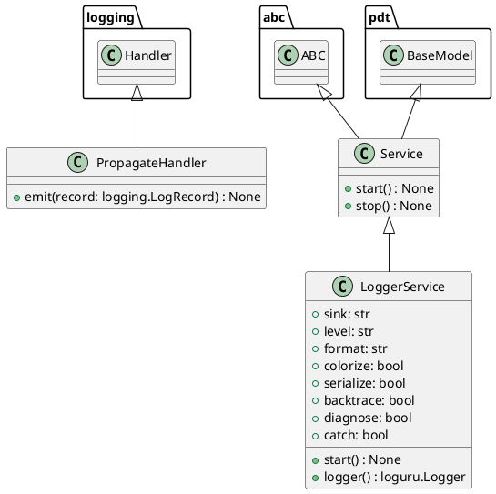

# Module Specification: logger_service

* **Source Reference:** `src/autogen_team/infrastructure/services/logger_service.py`

## 1. Architectural Role & Responsibilities
**Purpose:**
Logger Service - Logging with OpenTelemetry.

**Responsibilities:**
- [LLM Synthesis Required: Define responsibilities]

**Main Workflow:**
- [LLM Synthesis Required: Define main workflow]

## 2. Dependencies
**Imports:**
- `__future__.annotations`
- `abc`
- `logging`
- `sys`
- `loguru`
- `pydantic`
- `opentelemetry.trace`
- `opentelemetry._logs.set_logger_provider`
- `opentelemetry.exporter.otlp.proto.http._log_exporter.OTLPLogExporter`
- `opentelemetry.exporter.otlp.proto.http.trace_exporter.OTLPSpanExporter`
- `opentelemetry.sdk._logs.LoggerProvider`
- `opentelemetry.sdk._logs.LoggingHandler`
- `opentelemetry.sdk._logs.export.BatchLogRecordProcessor`
- `opentelemetry.sdk.resources.Resource`
- `opentelemetry.sdk.trace.TracerProvider`
- `opentelemetry.sdk.trace.export.BatchSpanProcessor`

**Exported Classes:**
- `PropagateHandler`
- `Service`
- `LoggerService`

**Exported Functions:**

## 3. Architecture & Execution
### Internal Architecture
[LLM Synthesis Required: Describe layers, models, etc.]

### Execution Flow
[LLM Synthesis Required: Describe execution flow]

### Sequence Explanation
[LLM Synthesis Required: Describe sequence]

## 4. UML 2.0 Diagrams
### Class Diagram


## 5. Class & Method Specifications
### `PropagateHandler` ([`src/autogen_team/infrastructure/services/logger_service.py`](/src/autogen_team/infrastructure/services/logger_service.py))
#### Overview
The `PropagateHandler` class provides specialized capabilities within the `logger_service` module, coordinating state and behaviors specific to its domain.

#### Constructor
**Initialization:** Default constructor. Initializes an empty instance.

#### Methods
##### `emit(self: Any, record: logging.LogRecord) -> None` (Public)
**Description:** Executes the emit operation, mutating state or calculating derived values as necessary.

**Inputs:**
- `record` (`logging.LogRecord`): Input parameter dictating the behavior of emit.

**Output:**
- Return Type: `None`
- Semantic Meaning: The resulting value after processing the emit action.

**Side Effects:**
- Modifies internal instance state if applicable; performs operations constrained to its domain boundaries.

**Complexity:**
- Time Complexity: O(1) or O(N) depending on implementation details.
- Space Complexity: O(1) auxiliary space expected.

**Example:**
```python
instance = PropagateHandler()
result = instance.emit(...)
```

### `Service` ([`src/autogen_team/infrastructure/services/logger_service.py`](/src/autogen_team/infrastructure/services/logger_service.py))
#### Overview
Base class for a global service.

#### Constructor
**Initialization:** Default constructor. Initializes an empty instance.

#### Methods
##### `start(self: Any) -> None` (Public)
**Description:** Start the service.

**Inputs:**

**Output:**
- Return Type: `None`
- Semantic Meaning: The resulting value after processing the start action.

**Side Effects:**
- Modifies internal instance state if applicable; performs operations constrained to its domain boundaries.

**Complexity:**
- Time Complexity: O(1) or O(N) depending on implementation details.
- Space Complexity: O(1) auxiliary space expected.

**Example:**
```python
instance = Service()
result = instance.start(...)
```

##### `stop(self: Any) -> None` (Public)
**Description:** Stop the service.

**Inputs:**

**Output:**
- Return Type: `None`
- Semantic Meaning: The resulting value after processing the stop action.

**Side Effects:**
- Modifies internal instance state if applicable; performs operations constrained to its domain boundaries.

**Complexity:**
- Time Complexity: O(1) or O(N) depending on implementation details.
- Space Complexity: O(1) auxiliary space expected.

**Example:**
```python
instance = Service()
result = instance.stop(...)
```

### `LoggerService` ([`src/autogen_team/infrastructure/services/logger_service.py`](/src/autogen_team/infrastructure/services/logger_service.py))
#### Overview
Service for logging messages.

https://loguru.readthedocs.io/en/stable/api/logger.html

#### Constructor
**Initialization:** Default constructor. Initializes an empty instance.

#### Attributes
- `sink` (`str`): Maintains the state for sink.
- `level` (`str`): Maintains the state for level.
- `format` (`str`): Maintains the state for format.
- `colorize` (`bool`): Maintains the state for colorize.
- `serialize` (`bool`): Maintains the state for serialize.
- `backtrace` (`bool`): Maintains the state for backtrace.
- `diagnose` (`bool`): Maintains the state for diagnose.
- `catch` (`bool`): Maintains the state for catch.

#### Methods
##### `start(self: Any) -> None` (Public)
**Description:** Executes the start operation, mutating state or calculating derived values as necessary.

**Inputs:**

**Output:**
- Return Type: `None`
- Semantic Meaning: The resulting value after processing the start action.

**Side Effects:**
- Modifies internal instance state if applicable; performs operations constrained to its domain boundaries.

**Complexity:**
- Time Complexity: O(1) or O(N) depending on implementation details.
- Space Complexity: O(1) auxiliary space expected.

**Example:**
```python
instance = LoggerService()
result = instance.start(...)
```

##### `logger(self: Any) -> loguru.Logger` (Public)
**Description:** Return the main logger.

**Inputs:**

**Output:**
- Return Type: `loguru.Logger`
- Semantic Meaning: The resulting value after processing the logger action.

**Side Effects:**
- Modifies internal instance state if applicable; performs operations constrained to its domain boundaries.

**Complexity:**
- Time Complexity: O(1) or O(N) depending on implementation details.
- Space Complexity: O(1) auxiliary space expected.

**Example:**
```python
instance = LoggerService()
result = instance.logger(...)
```

## 6. Module Functions