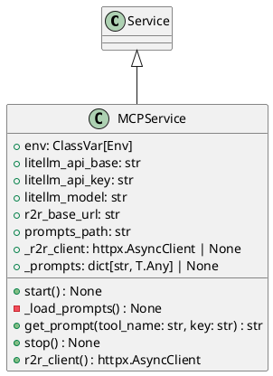

# Module Specification: mcp_service

* **Source Reference:** `src/autogen_team/infrastructure/services/mcp_service.py`

## 1. Architectural Role & Responsibilities
**Purpose:**
MCP Service - Model Context Protocol Server Lifecycle.

**Responsibilities:**
- [LLM Synthesis Required: Define responsibilities]

**Main Workflow:**
- [LLM Synthesis Required: Define main workflow]

## 2. Dependencies
**Imports:**
- `__future__.annotations`
- `typing`
- `typing.ClassVar`
- `httpx`
- `litellm`
- `pydantic.Field`
- `autogen_team.infrastructure.io.osvariables.Env`
- `logger_service.Service`

**Exported Classes:**
- `MCPService`

**Exported Functions:**

## 3. Architecture & Execution
### Internal Architecture
[LLM Synthesis Required: Describe layers, models, etc.]

### Execution Flow
[LLM Synthesis Required: Describe execution flow]

### Sequence Explanation
[LLM Synthesis Required: Describe sequence]

## 4. UML 2.0 Diagrams
### Class Diagram


## 5. Class & Method Specifications
### `MCPService` ([`src/autogen_team/infrastructure/services/mcp_service.py`](/src/autogen_team/infrastructure/services/mcp_service.py))
#### Overview
Service for MCP server lifecycle and backend clients.

Manages LiteLLM and R2R HTTP client initialization, providing
a single point of access for all MCP tool backends.

Parameters:
    litellm_api_base (str): LiteLLM API base URL.
    litellm_api_key (str): LiteLLM API key.
    litellm_model (str): Default LiteLLM model identifier.
    r2r_base_url (str): R2R RAG API base URL.

#### Constructor
**Initialization:** Default constructor. Initializes an empty instance.

#### Attributes
- `env` (`ClassVar[Env]`): Maintains the state for env.
- `litellm_api_base` (`str`): Maintains the state for litellm_api_base.
- `litellm_api_key` (`str`): Maintains the state for litellm_api_key.
- `litellm_model` (`str`): Maintains the state for litellm_model.
- `r2r_base_url` (`str`): Maintains the state for r2r_base_url.
- `prompts_path` (`str`): Maintains the state for prompts_path.
- `_r2r_client` (`httpx.AsyncClient | None`): Maintains the state for _r2r_client.
- `_prompts` (`dict[str, T.Any] | None`): Maintains the state for _prompts.

#### Methods
##### `start(self: Any) -> None` (Public)
**Description:** Initialize LiteLLM configuration and R2R HTTP client.

**Inputs:**

**Output:**
- Return Type: `None`
- Semantic Meaning: The resulting value after processing the start action.

**Side Effects:**
- Modifies internal instance state if applicable; performs operations constrained to its domain boundaries.

**Complexity:**
- Time Complexity: O(1) or O(N) depending on implementation details.
- Space Complexity: O(1) auxiliary space expected.

**Example:**
```python
instance = MCPService()
result = instance.start(...)
```

##### `_load_prompts(self: Any) -> None` (Private)
- **Purpose**: Load prompts from YAML file.
- **Parameters**:
- **Return value**: `None`

##### `get_prompt(self: Any, tool_name: str, key: str) -> str` (Public)
**Description:** Get a specific prompt for a tool and key.

**Inputs:**
- `tool_name` (`str`): Input parameter dictating the behavior of get_prompt.
- `key` (`str`): Input parameter dictating the behavior of get_prompt.

**Output:**
- Return Type: `str`
- Semantic Meaning: The resulting value after processing the get_prompt action.

**Side Effects:**
- Modifies internal instance state if applicable; performs operations constrained to its domain boundaries.

**Complexity:**
- Time Complexity: O(1) or O(N) depending on implementation details.
- Space Complexity: O(1) auxiliary space expected.

**Example:**
```python
instance = MCPService()
result = instance.get_prompt(...)
```

##### `stop(self: Any) -> None` (Public)
**Description:** Stop the MCP service and close HTTP clients.

**Inputs:**

**Output:**
- Return Type: `None`
- Semantic Meaning: The resulting value after processing the stop action.

**Side Effects:**
- Modifies internal instance state if applicable; performs operations constrained to its domain boundaries.

**Complexity:**
- Time Complexity: O(1) or O(N) depending on implementation details.
- Space Complexity: O(1) auxiliary space expected.

**Example:**
```python
instance = MCPService()
result = instance.stop(...)
```

##### `r2r_client(self: Any) -> httpx.AsyncClient` (Public)
**Description:** Return the R2R async HTTP client.

**Inputs:**

**Output:**
- Return Type: `httpx.AsyncClient`
- Semantic Meaning: The resulting value after processing the r2r_client action.

**Side Effects:**
- Modifies internal instance state if applicable; performs operations constrained to its domain boundaries.

**Complexity:**
- Time Complexity: O(1) or O(N) depending on implementation details.
- Space Complexity: O(1) auxiliary space expected.

**Example:**
```python
instance = MCPService()
result = instance.r2r_client(...)
```

## 6. Module Functions