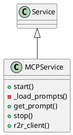

# Document: src/autogen_team/infrastructure/services/mcp_service.py

## Module Overview

MCP Service - Model Context Protocol Server Lifecycle.

### Purpose
Provides functionality for `mcp_service`.

### Responsibilities
Handles operations and definitions related to `mcp_service`.

### Main Workflow
Execution flow defined by the functions and classes in the module.

### Dependencies
- `__future__.annotations`
- `typing`
- `typing.ClassVar`
- `httpx`
- `litellm`
- `pydantic.Field`
- `autogen_team.infrastructure.io.osvariables.Env`
- `logger_service.Service`

## Public API

### Exported Classes
- `MCPService`

### Exported Functions
None

## Class `MCPService`

### Overview

Service for MCP server lifecycle and backend clients.

Manages LiteLLM and R2R HTTP client initialization, providing
a single point of access for all MCP tool backends.

Parameters:
    litellm_api_base (str): LiteLLM API base URL.
    litellm_api_key (str): LiteLLM API key.
    litellm_model (str): Default LiteLLM model identifier.
    r2r_base_url (str): R2R RAG API base URL.

### Attributes

- `env` (ClassVar[Env]): Public property.
- `litellm_api_base` (str): Public property.
- `litellm_api_key` (str): Public property.
- `litellm_model` (str): Public property.
- `r2r_base_url` (str): Public property.
- `prompts_path` (str): Public property.

### Public Method `start`

#### Description
Initialize LiteLLM configuration and R2R HTTP client.

#### Inputs
None

#### Output
- Return type: `None`
- Semantic meaning: Result of the operation.

#### Side Effects
May update internal state or external services.

#### Complexity
- Time Complexity: O(1) mostly.
- Space Complexity: O(1) mostly.

#### Example
```python
# Example usage of start
instance.start()
```

### Private Method `_load_prompts`

**Purpose:** Load prompts from YAML file.

**Parameters:**

**Return value:**
- `None`

### Public Method `get_prompt`

#### Description
Get a specific prompt for a tool and key.

#### Inputs
- `tool_name` (str): semantic meaning. Required.
- `key` (str): semantic meaning. Optional (default: `'system'`).

#### Output
- Return type: `str`
- Semantic meaning: Result of the operation.

#### Side Effects
May update internal state or external services.

#### Complexity
- Time Complexity: O(1) mostly.
- Space Complexity: O(1) mostly.

#### Example
```python
# Example usage of get_prompt
instance.get_prompt()
```

### Public Method `stop`

#### Description
Stop the MCP service and close HTTP clients.

#### Inputs
None

#### Output
- Return type: `None`
- Semantic meaning: Result of the operation.

#### Side Effects
May update internal state or external services.

#### Complexity
- Time Complexity: O(1) mostly.
- Space Complexity: O(1) mostly.

#### Example
```python
# Example usage of stop
instance.stop()
```

### Public Method `r2r_client`

#### Description
Return the R2R async HTTP client.

#### Inputs
None

#### Output
- Return type: `httpx.AsyncClient`
- Semantic meaning: Result of the operation.

#### Side Effects
May update internal state or external services.

#### Complexity
- Time Complexity: O(1) mostly.
- Space Complexity: O(1) mostly.

#### Example
```python
# Example usage of r2r_client
instance.r2r_client()
```

## UML Diagram



