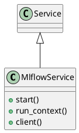

# Document: src/autogen_team/infrastructure/services/mlflow_service.py

## Module Overview

MLflow Service - Tracking and Registry.

### Purpose
Provides functionality for `mlflow_service`.

### Responsibilities
Handles operations and definitions related to `mlflow_service`.

### Main Workflow
Execution flow defined by the functions and classes in the module.

### Dependencies
- `__future__.annotations`
- `contextlib`
- `os`
- `typing`
- `typing.ClassVar`
- `mlflow`
- `mlflow.tracking`
- `pydantic`
- `autogen_team.infrastructure.io.osvariables.Env`
- `logger_service.Service`

## Public API

### Exported Classes
- `MlflowService`

### Exported Functions
None

## Class `MlflowService`

### Overview

Service for Mlflow tracking and registry.

### Attributes

- `env` (ClassVar[Env]): Public property.
- `tracking_uri` (str): Public property.
- `registry_uri` (str): Public property.
- `experiment_name` (str): Public property.
- `registry_name` (str): Public property.
- `autolog_disable` (bool): Public property.
- `autolog_disable_for_unsupported_versions` (bool): Public property.
- `autolog_exclusive` (bool): Public property.
- `autolog_log_input_examples` (bool): Public property.
- `autolog_log_model_signatures` (bool): Public property.
- `autolog_log_models` (bool): Public property.
- `autolog_log_datasets` (bool): Public property.
- `autolog_silent` (bool): Public property.

### Public Method `start`

#### Description
No description provided.

#### Inputs
None

#### Output
- Return type: `None`
- Semantic meaning: Result of the operation.

#### Side Effects
May update internal state or external services.

#### Complexity
- Time Complexity: O(1) mostly.
- Space Complexity: O(1) mostly.

#### Example
```python
# Example usage of start
instance.start()
```

### Public Method `run_context`

#### Description
Yield an active Mlflow run and exit it afterwards.

#### Inputs
- `run_config` (RunConfig): semantic meaning. Required.

#### Output
- Return type: `T.Generator[(mlflow.ActiveRun, None, None)]`
- Semantic meaning: Result of the operation.

#### Side Effects
May update internal state or external services.

#### Complexity
- Time Complexity: O(1) mostly.
- Space Complexity: O(1) mostly.

#### Example
```python
# Example usage of run_context
instance.run_context()
```

### Public Method `client`

#### Description
Return a new Mlflow client.

#### Inputs
None

#### Output
- Return type: `mt.MlflowClient`
- Semantic meaning: Result of the operation.

#### Side Effects
May update internal state or external services.

#### Complexity
- Time Complexity: O(1) mostly.
- Space Complexity: O(1) mostly.

#### Example
```python
# Example usage of client
instance.client()
```

## UML Diagram



