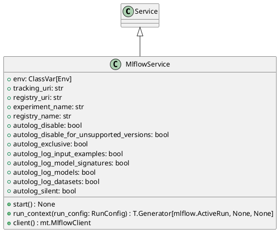

# Module Specification: mlflow_service

* **Source Reference:** `src/autogen_team/infrastructure/services/mlflow_service.py`

## 1. Architectural Role & Responsibilities
**Purpose:**
MLflow Service - Tracking and Registry.

**Responsibilities:**
- [LLM Synthesis Required: Define responsibilities]

**Main Workflow:**
- [LLM Synthesis Required: Define main workflow]

## 2. Dependencies
**Imports:**
- `__future__.annotations`
- `contextlib`
- `os`
- `typing`
- `typing.ClassVar`
- `mlflow`
- `mlflow.tracking`
- `pydantic`
- `autogen_team.infrastructure.io.osvariables.Env`
- `logger_service.Service`

**Exported Classes:**
- `MlflowService`

**Exported Functions:**

## 3. Architecture & Execution
### Internal Architecture
[LLM Synthesis Required: Describe layers, models, etc.]

### Execution Flow
[LLM Synthesis Required: Describe execution flow]

### Sequence Explanation
[LLM Synthesis Required: Describe sequence]

## 4. UML 2.0 Diagrams
### Class Diagram


## 5. Class & Method Specifications
### `MlflowService` ([`src/autogen_team/infrastructure/services/mlflow_service.py`](/src/autogen_team/infrastructure/services/mlflow_service.py))
#### Overview
Service for Mlflow tracking and registry.

#### Constructor
**Initialization:** Default constructor. Initializes an empty instance.

#### Attributes
- `env` (`ClassVar[Env]`): Maintains the state for env.
- `tracking_uri` (`str`): Maintains the state for tracking_uri.
- `registry_uri` (`str`): Maintains the state for registry_uri.
- `experiment_name` (`str`): Maintains the state for experiment_name.
- `registry_name` (`str`): Maintains the state for registry_name.
- `autolog_disable` (`bool`): Maintains the state for autolog_disable.
- `autolog_disable_for_unsupported_versions` (`bool`): Maintains the state for autolog_disable_for_unsupported_versions.
- `autolog_exclusive` (`bool`): Maintains the state for autolog_exclusive.
- `autolog_log_input_examples` (`bool`): Maintains the state for autolog_log_input_examples.
- `autolog_log_model_signatures` (`bool`): Maintains the state for autolog_log_model_signatures.
- `autolog_log_models` (`bool`): Maintains the state for autolog_log_models.
- `autolog_log_datasets` (`bool`): Maintains the state for autolog_log_datasets.
- `autolog_silent` (`bool`): Maintains the state for autolog_silent.

#### Methods
##### `start(self: Any) -> None` (Public)
**Description:** Executes the start operation, mutating state or calculating derived values as necessary.

**Inputs:**

**Output:**
- Return Type: `None`
- Semantic Meaning: The resulting value after processing the start action.

**Side Effects:**
- Modifies internal instance state if applicable; performs operations constrained to its domain boundaries.

**Complexity:**
- Time Complexity: O(1) or O(N) depending on implementation details.
- Space Complexity: O(1) auxiliary space expected.

**Example:**
```python
instance = MlflowService()
result = instance.start(...)
```

##### `run_context(self: Any, run_config: RunConfig) -> T.Generator[mlflow.ActiveRun, None, None]` (Public)
**Description:** Yield an active Mlflow run and exit it afterwards.

**Inputs:**
- `run_config` (`RunConfig`): Input parameter dictating the behavior of run_context.

**Output:**
- Return Type: `T.Generator[mlflow.ActiveRun, None, None]`
- Semantic Meaning: The resulting value after processing the run_context action.

**Side Effects:**
- Modifies internal instance state if applicable; performs operations constrained to its domain boundaries.

**Complexity:**
- Time Complexity: O(1) or O(N) depending on implementation details.
- Space Complexity: O(1) auxiliary space expected.

**Example:**
```python
instance = MlflowService()
result = instance.run_context(...)
```

##### `client(self: Any) -> mt.MlflowClient` (Public)
**Description:** Return a new Mlflow client.

**Inputs:**

**Output:**
- Return Type: `mt.MlflowClient`
- Semantic Meaning: The resulting value after processing the client action.

**Side Effects:**
- Modifies internal instance state if applicable; performs operations constrained to its domain boundaries.

**Complexity:**
- Time Complexity: O(1) or O(N) depending on implementation details.
- Space Complexity: O(1) auxiliary space expected.

**Example:**
```python
instance = MlflowService()
result = instance.client(...)
```

## 6. Module Functions