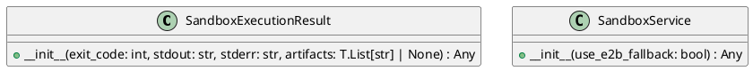

# Module Specification: sandbox_service

* **Source Reference:** `src/autogen_team/infrastructure/services/sandbox_service.py`

## 1. Architectural Role & Responsibilities
**Purpose:**
Sandbox Service — manages the lifecycle of hardware-isolated MicroVMs.

**Responsibilities:**
- [LLM Synthesis Required: Define responsibilities]

**Main Workflow:**
- [LLM Synthesis Required: Define main workflow]

## 2. Dependencies
**Imports:**
- `__future__.annotations`
- `os`
- `shlex`
- `typing`
- `uuid`
- `boto3`
- `loguru.logger`
- `autogen_team.core.security.safe_join`

**Exported Classes:**
- `SandboxExecutionResult`
- `SandboxService`

**Exported Functions:**

## 3. Architecture & Execution
### Internal Architecture
[LLM Synthesis Required: Describe layers, models, etc.]

### Execution Flow
[LLM Synthesis Required: Describe execution flow]

### Sequence Explanation
[LLM Synthesis Required: Describe sequence]

## 4. UML 2.0 Diagrams
### Class Diagram


## 5. Class & Method Specifications
### `SandboxExecutionResult` ([`src/autogen_team/infrastructure/services/sandbox_service.py`](/src/autogen_team/infrastructure/services/sandbox_service.py))
#### Overview
Result of a command execution inside the sandbox.

#### Constructor
**Initialization:** Initializes `SandboxExecutionResult` with required dependencies and sets up initial internal state.

#### Methods
##### `__init__(self: Any, exit_code: int, stdout: str, stderr: str, artifacts: T.List[str] | None) -> Any` (Public)
**Description:** Executes the __init__ operation, mutating state or calculating derived values as necessary.

**Inputs:**
- `exit_code` (`int`): Input parameter dictating the behavior of __init__.
- `stdout` (`str`): Input parameter dictating the behavior of __init__.
- `stderr` (`str`): Input parameter dictating the behavior of __init__.
- `artifacts` (`T.List[str] | None`): Input parameter dictating the behavior of __init__.

**Output:**
- Return Type: `Any`
- Semantic Meaning: The resulting value after processing the __init__ action.

**Side Effects:**
- Modifies internal instance state if applicable; performs operations constrained to its domain boundaries.

**Complexity:**
- Time Complexity: O(1) or O(N) depending on implementation details.
- Space Complexity: O(1) auxiliary space expected.

**Example:**
```python
instance = SandboxExecutionResult()
result = instance.__init__(...)
```

### `SandboxService` ([`src/autogen_team/infrastructure/services/sandbox_service.py`](/src/autogen_team/infrastructure/services/sandbox_service.py))
#### Overview
Manages ephemeral MicroVM sandboxes for secure code execution.

#### Constructor
**Initialization:** Initializes `SandboxService` with required dependencies and sets up initial internal state.

#### Methods
##### `__init__(self: Any, use_e2b_fallback: bool) -> Any` (Public)
**Description:** Executes the __init__ operation, mutating state or calculating derived values as necessary.

**Inputs:**
- `use_e2b_fallback` (`bool`): Input parameter dictating the behavior of __init__.

**Output:**
- Return Type: `Any`
- Semantic Meaning: The resulting value after processing the __init__ action.

**Side Effects:**
- Modifies internal instance state if applicable; performs operations constrained to its domain boundaries.

**Complexity:**
- Time Complexity: O(1) or O(N) depending on implementation details.
- Space Complexity: O(1) auxiliary space expected.

**Example:**
```python
instance = SandboxService()
result = instance.__init__(...)
```

## 6. Module Functions