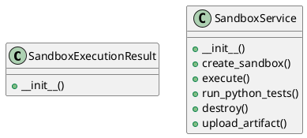

# Document: src/autogen_team/infrastructure/services/sandbox_service.py

## Module Overview

Sandbox Service — manages the lifecycle of hardware-isolated MicroVMs.

### Purpose
Provides functionality for `sandbox_service`.

### Responsibilities
Handles operations and definitions related to `sandbox_service`.

### Main Workflow
Execution flow defined by the functions and classes in the module.

### Dependencies
- `__future__.annotations`
- `os`
- `shlex`
- `typing`
- `uuid`
- `boto3`
- `loguru.logger`
- `autogen_team.core.security.safe_join`

## Public API

### Exported Classes
- `SandboxExecutionResult`
- `SandboxService`

### Exported Functions
None

## Class `SandboxExecutionResult`

### Overview

Result of a command execution inside the sandbox.

### Constructor

No description provided.

**Parameters:**
- `exit_code` (int)
- `stdout` (str)
- `stderr` (str)
- `artifacts` (T.List[str] | None) = `None`

## Class `SandboxService`

### Overview

Manages ephemeral MicroVM sandboxes for secure code execution.

### Constructor

No description provided.

**Parameters:**
- `use_e2b_fallback` (bool) = `True`

### Public Method `create_sandbox`

#### Description
Create a new sandbox instance.

Args:
    metadata: Optional metadata for the sandbox.

Returns:
    sandbox_id: Unique identifier for the sandbox.

#### Inputs
- `metadata` (T.Dict[(str, T.Any)] | None): semantic meaning. Optional (default: `None`).

#### Output
- Return type: `str`
- Semantic meaning: Result of the operation.

#### Side Effects
May update internal state or external services.

#### Complexity
- Time Complexity: O(1) mostly.
- Space Complexity: O(1) mostly.

#### Example
```python
# Example usage of create_sandbox
instance.create_sandbox()
```

### Public Method `execute`

#### Description
Execute a command inside the specified sandbox.

Args:
    sandbox_id: The ID of the sandbox.
    command: The command to execute.

Returns:
    SandboxExecutionResult object.

#### Inputs
- `sandbox_id` (str): semantic meaning. Required.
- `command` (str): semantic meaning. Required.

#### Output
- Return type: `SandboxExecutionResult`
- Semantic meaning: Result of the operation.

#### Side Effects
May update internal state or external services.

#### Complexity
- Time Complexity: O(1) mostly.
- Space Complexity: O(1) mostly.

#### Example
```python
# Example usage of execute
instance.execute()
```

### Public Method `run_python_tests`

#### Description
Specific helper to run pytest inside the sandbox.

Args:
    sandbox_id: The ID of the sandbox.
    workspace_dir: The directory inside the sandbox where code is located.

Returns:
    SandboxExecutionResult object.

#### Inputs
- `sandbox_id` (str): semantic meaning. Required.
- `workspace_dir` (str): semantic meaning. Required.

#### Output
- Return type: `SandboxExecutionResult`
- Semantic meaning: Result of the operation.

#### Side Effects
May update internal state or external services.

#### Complexity
- Time Complexity: O(1) mostly.
- Space Complexity: O(1) mostly.

#### Example
```python
# Example usage of run_python_tests
instance.run_python_tests()
```

### Public Method `destroy`

#### Description
Tear down a sandbox instance.

Args:
    sandbox_id: The ID of the sandbox to destroy.

#### Inputs
- `sandbox_id` (str): semantic meaning. Required.

#### Output
- Return type: `None`
- Semantic meaning: Result of the operation.

#### Side Effects
May update internal state or external services.

#### Complexity
- Time Complexity: O(1) mostly.
- Space Complexity: O(1) mostly.

#### Example
```python
# Example usage of destroy
instance.destroy()
```

### Public Method `upload_artifact`

#### Description
Upload a file from the local environment (captured from sandbox) to MinIO.

Args:
    sandbox_id: The ID of the sandbox.
    file_path: Local path to the file.
    bucket_name: Target bucket name.

Returns:
    The S3 URL of the uploaded artifact.

#### Inputs
- `sandbox_id` (str): semantic meaning. Required.
- `file_path` (str): semantic meaning. Required.
- `bucket_name` (str): semantic meaning. Optional (default: `'agent-workspace'`).

#### Output
- Return type: `str`
- Semantic meaning: Result of the operation.

#### Side Effects
May update internal state or external services.

#### Complexity
- Time Complexity: O(1) mostly.
- Space Complexity: O(1) mostly.

#### Example
```python
# Example usage of upload_artifact
instance.upload_artifact()
```

## UML Diagram



