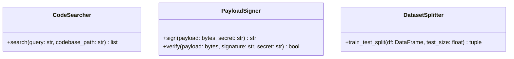

# Module Name: infrastructure/utils

* **Source Directory Reference:** `src/autogen_team/infrastructure/utils/`
* **Package Dependency:** Upstream: `cryptography`, `scikit-learn`, `pandas`. Downstream: `src/autogen_team/application/jobs/`, `src/autogen_team/data_access/`.

## 1. Executive Summary & Purpose

The `infrastructure/utils` module provides utility helper modules:
* `searchers.py`: Code/symbol search and similarity matching utilities.
* `signers.py`: Cryptographic HMAC payload signing and signature verification.
* `splitters.py`: Train/test/validation dataset splitting methods.

## 2. UML 2.0 Class & Utilities Architecture (Deterministic)

## 3. Package & Class Relations

* **Dataset Splitting:** `DatasetSplitter` integrates with `pandas` and `scikit-learn` to produce reproducible train/test splits during model training jobs (`Training`).
* **Cryptographic Signatures:** `PayloadSigner` signs inter-service Webhooks and A2A messages to prevent message tampering.

---

* **Source Citations:**
  * Searchers Utility: `src/autogen_team/infrastructure/utils/searchers.py:1-25`
  * Signers Utility: `src/autogen_team/infrastructure/utils/signers.py:1-25`
  * Splitters Utility: `src/autogen_team/infrastructure/utils/splitters.py:1-25`
