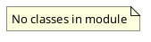

# Document: src/autogen_team/infrastructure/utils/__init__.py

## Module Overview

Infrastructure Utilities - Signers, splitters, searchers, and time.

### Purpose
Provides functionality for `__init__`.

### Responsibilities
Handles operations and definitions related to `__init__`.

### Main Workflow
Execution flow defined by the functions and classes in the module.

### Dependencies
- `searchers.CrossValidation`
- `searchers.Grid`
- `searchers.GridCVSearcher`
- `searchers.Results`
- `searchers.Searcher`
- `searchers.SearcherKind`
- `signers.InferSigner`
- `signers.Signature`
- `signers.Signer`
- `signers.SignerKind`
- `splitters.Index`
- `splitters.Splitter`
- `splitters.SplitterKind`
- `splitters.TimeSeriesSplitter`
- `splitters.TrainTestIndex`
- `splitters.TrainTestSplits`
- `splitters.TrainTestSplitter`

## Public API

### Exported Classes
None

### Exported Functions
None

## UML Diagram

