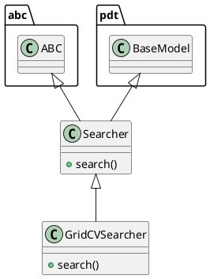

# Document: src/autogen_team/infrastructure/utils/searchers.py

## Module Overview

Find the best hyperparameters for a model.

### Purpose
Provides functionality for `searchers`.

### Responsibilities
Handles operations and definitions related to `searchers`.

### Main Workflow
Execution flow defined by the functions and classes in the module.

### Dependencies
- `abc`
- `typing`
- `pandas`
- `pydantic`
- `sklearn.model_selection`
- `autogen_team.core.schemas`
- `autogen_team.evaluation.metrics`
- `autogen_team.infrastructure.utils.splitters`
- `autogen_team.models.entities`

## Public API

### Exported Classes
- `Searcher`
- `GridCVSearcher`

### Exported Functions
None

## Class `Searcher`

### Overview

Base class for a searcher.

Use searcher to fine-tune models.
i.e., to find the best model params.

Parameters:
    param_grid (Grid): mapping of param key -> values.

### Attributes

- `KIND` (str): Public property.
- `param_grid` (Grid): Public property.

### Public Method `search`

#### Description
Search the best model for the given inputs and targets.

Args:
    model (models.Model): AI/ML model to fine-tune.
    metric (metrics.Metric): main metric to optimize.
    inputs (schemas.Inputs): model inputs for tuning.
    targets (schemas.Targets): model targets for tuning.
    cv (CrossValidation): choice for cross-fold validation.

Returns:
    Results: all the results of the searcher execution process.

#### Inputs
- `model` (models.Model): semantic meaning. Required.
- `metric` (metrics.Metric): semantic meaning. Required.
- `inputs` (schemas.Inputs): semantic meaning. Required.
- `targets` (schemas.Targets): semantic meaning. Required.
- `cv` (CrossValidation): semantic meaning. Required.

#### Output
- Return type: `Results`
- Semantic meaning: Result of the operation.

#### Side Effects
May update internal state or external services.

#### Complexity
- Time Complexity: O(1) mostly.
- Space Complexity: O(1) mostly.

#### Example
```python
# Example usage of search
instance.search()
```

## Class `GridCVSearcher`

### Overview

Grid searcher with cross-fold validation.

Convention: metric returns higher values for better models.

Parameters:
    n_jobs (int, optional): number of jobs to run in parallel.
    refit (bool): refit the model after the tuning.
    verbose (int): set the searcher verbosity level.
    error_score (str | float): strategy or value on error.
    return_train_score (bool): include train scores if True.

### Attributes

- `KIND` (T.Literal[GridCVSearcher]): Public property.
- `n_jobs` (int | None): Public property.
- `refit` (bool): Public property.
- `verbose` (int): Public property.
- `error_score` (str | float): Public property.
- `return_train_score` (bool): Public property.

### Public Method `search`

#### Description
No description provided.

#### Inputs
- `model` (models.Model): semantic meaning. Required.
- `metric` (metrics.Metric): semantic meaning. Required.
- `inputs` (schemas.Inputs): semantic meaning. Required.
- `targets` (schemas.Targets): semantic meaning. Required.
- `cv` (CrossValidation): semantic meaning. Required.

#### Output
- Return type: `Results`
- Semantic meaning: Result of the operation.

#### Side Effects
May update internal state or external services.

#### Complexity
- Time Complexity: O(1) mostly.
- Space Complexity: O(1) mostly.

#### Example
```python
# Example usage of search
instance.search()
```

## UML Diagram



