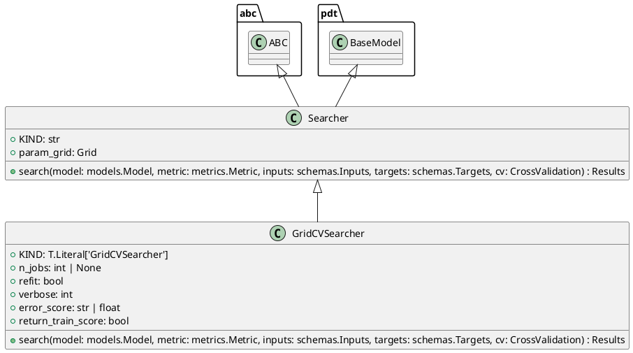

# Module Specification: searchers

* **Source Reference:** `src/autogen_team/infrastructure/utils/searchers.py`

## 1. Architectural Role & Responsibilities
**Purpose:**
Find the best hyperparameters for a model.

**Responsibilities:**
- [LLM Synthesis Required: Define responsibilities]

**Main Workflow:**
- [LLM Synthesis Required: Define main workflow]

## 2. Dependencies
**Imports:**
- `abc`
- `typing`
- `pandas`
- `pydantic`
- `sklearn.model_selection`
- `autogen_team.core.schemas`
- `autogen_team.evaluation.metrics`
- `autogen_team.infrastructure.utils.splitters`
- `autogen_team.models.entities`

**Exported Classes:**
- `Searcher`
- `GridCVSearcher`

**Exported Functions:**

## 3. Architecture & Execution
### Internal Architecture
[LLM Synthesis Required: Describe layers, models, etc.]

### Execution Flow
[LLM Synthesis Required: Describe execution flow]

### Sequence Explanation
[LLM Synthesis Required: Describe sequence]

## 4. UML 2.0 Diagrams
### Class Diagram


## 5. Class & Method Specifications
### `Searcher` ([`src/autogen_team/infrastructure/utils/searchers.py`](/src/autogen_team/infrastructure/utils/searchers.py))
#### Overview
Base class for a searcher.

Use searcher to fine-tune models.
i.e., to find the best model params.

Parameters:
    param_grid (Grid): mapping of param key -> values.

#### Constructor
**Initialization:** Default constructor. Initializes an empty instance.

#### Attributes
- `KIND` (`str`): Maintains the state for KIND.
- `param_grid` (`Grid`): Maintains the state for param_grid.

#### Methods
##### `search(self: Any, model: models.Model, metric: metrics.Metric, inputs: schemas.Inputs, targets: schemas.Targets, cv: CrossValidation) -> Results` (Public)
**Description:** Search the best model for the given inputs and targets.

Args:
    model (models.Model): AI/ML model to fine-tune.
    metric (metrics.Metric): main metric to optimize.
    inputs (schemas.Inputs): model inputs for tuning.
    targets (schemas.Targets): model targets for tuning.
    cv (CrossValidation): choice for cross-fold validation.

Returns:
    Results: all the results of the searcher execution process.

**Inputs:**
- `model` (`models.Model`): Input parameter dictating the behavior of search.
- `metric` (`metrics.Metric`): Input parameter dictating the behavior of search.
- `inputs` (`schemas.Inputs`): Input parameter dictating the behavior of search.
- `targets` (`schemas.Targets`): Input parameter dictating the behavior of search.
- `cv` (`CrossValidation`): Input parameter dictating the behavior of search.

**Output:**
- Return Type: `Results`
- Semantic Meaning: The resulting value after processing the search action.

**Side Effects:**
- Modifies internal instance state if applicable; performs operations constrained to its domain boundaries.

**Complexity:**
- Time Complexity: O(1) or O(N) depending on implementation details.
- Space Complexity: O(1) auxiliary space expected.

**Example:**
```python
instance = Searcher()
result = instance.search(...)
```

### `GridCVSearcher` ([`src/autogen_team/infrastructure/utils/searchers.py`](/src/autogen_team/infrastructure/utils/searchers.py))
#### Overview
Grid searcher with cross-fold validation.

Convention: metric returns higher values for better models.

Parameters:
    n_jobs (int, optional): number of jobs to run in parallel.
    refit (bool): refit the model after the tuning.
    verbose (int): set the searcher verbosity level.
    error_score (str | float): strategy or value on error.
    return_train_score (bool): include train scores if True.

#### Constructor
**Initialization:** Default constructor. Initializes an empty instance.

#### Attributes
- `KIND` (`T.Literal['GridCVSearcher']`): Maintains the state for KIND.
- `n_jobs` (`int | None`): Maintains the state for n_jobs.
- `refit` (`bool`): Maintains the state for refit.
- `verbose` (`int`): Maintains the state for verbose.
- `error_score` (`str | float`): Maintains the state for error_score.
- `return_train_score` (`bool`): Maintains the state for return_train_score.

#### Methods
##### `search(self: Any, model: models.Model, metric: metrics.Metric, inputs: schemas.Inputs, targets: schemas.Targets, cv: CrossValidation) -> Results` (Public)
**Description:** Executes the search operation, mutating state or calculating derived values as necessary.

**Inputs:**
- `model` (`models.Model`): Input parameter dictating the behavior of search.
- `metric` (`metrics.Metric`): Input parameter dictating the behavior of search.
- `inputs` (`schemas.Inputs`): Input parameter dictating the behavior of search.
- `targets` (`schemas.Targets`): Input parameter dictating the behavior of search.
- `cv` (`CrossValidation`): Input parameter dictating the behavior of search.

**Output:**
- Return Type: `Results`
- Semantic Meaning: The resulting value after processing the search action.

**Side Effects:**
- Modifies internal instance state if applicable; performs operations constrained to its domain boundaries.

**Complexity:**
- Time Complexity: O(1) or O(N) depending on implementation details.
- Space Complexity: O(1) auxiliary space expected.

**Example:**
```python
instance = GridCVSearcher()
result = instance.search(...)
```

## 6. Module Functions