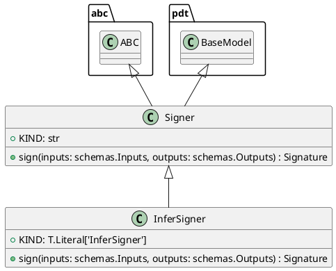

# Module Specification: signers

* **Source Reference:** `src/autogen_team/infrastructure/utils/signers.py`

## 1. Architectural Role & Responsibilities
**Purpose:**
Generate signatures for AI/ML models.

**Responsibilities:**
- [LLM Synthesis Required: Define responsibilities]

**Main Workflow:**
- [LLM Synthesis Required: Define main workflow]

## 2. Dependencies
**Imports:**
- `abc`
- `typing`
- `mlflow`
- `pydantic`
- `mlflow.models.signature`
- `autogen_team.core.schemas`

**Exported Classes:**
- `Signer`
- `InferSigner`

**Exported Functions:**

## 3. Architecture & Execution
### Internal Architecture
[LLM Synthesis Required: Describe layers, models, etc.]

### Execution Flow
[LLM Synthesis Required: Describe execution flow]

### Sequence Explanation
[LLM Synthesis Required: Describe sequence]

## 4. UML 2.0 Diagrams
### Class Diagram


## 5. Class & Method Specifications
### `Signer` ([`src/autogen_team/infrastructure/utils/signers.py`](/src/autogen_team/infrastructure/utils/signers.py))
#### Overview
Base class for generating model signatures.

Allow to switch between model signing strategies.
e.g., automatic inference, manual model signature, ...

https://mlflow.org/docs/latest/models.html#model-signature-and-input-example

#### Constructor
**Initialization:** Default constructor. Initializes an empty instance.

#### Attributes
- `KIND` (`str`): Maintains the state for KIND.

#### Methods
##### `sign(self: Any, inputs: schemas.Inputs, outputs: schemas.Outputs) -> Signature` (Public)
**Description:** Generate a model signature from its inputs/outputs.

Args:
    inputs (schemas.Inputs): inputs data.
    outputs (schemas.Outputs): outputs data.

Returns:
    Signature: signature of the model.

**Inputs:**
- `inputs` (`schemas.Inputs`): Input parameter dictating the behavior of sign.
- `outputs` (`schemas.Outputs`): Input parameter dictating the behavior of sign.

**Output:**
- Return Type: `Signature`
- Semantic Meaning: The resulting value after processing the sign action.

**Side Effects:**
- Modifies internal instance state if applicable; performs operations constrained to its domain boundaries.

**Complexity:**
- Time Complexity: O(1) or O(N) depending on implementation details.
- Space Complexity: O(1) auxiliary space expected.

**Example:**
```python
instance = Signer()
result = instance.sign(...)
```

### `InferSigner` ([`src/autogen_team/infrastructure/utils/signers.py`](/src/autogen_team/infrastructure/utils/signers.py))
#### Overview
Generate model signatures from inputs/outputs data.

#### Constructor
**Initialization:** Default constructor. Initializes an empty instance.

#### Attributes
- `KIND` (`T.Literal['InferSigner']`): Maintains the state for KIND.

#### Methods
##### `sign(self: Any, inputs: schemas.Inputs, outputs: schemas.Outputs) -> Signature` (Public)
**Description:** Executes the sign operation, mutating state or calculating derived values as necessary.

**Inputs:**
- `inputs` (`schemas.Inputs`): Input parameter dictating the behavior of sign.
- `outputs` (`schemas.Outputs`): Input parameter dictating the behavior of sign.

**Output:**
- Return Type: `Signature`
- Semantic Meaning: The resulting value after processing the sign action.

**Side Effects:**
- Modifies internal instance state if applicable; performs operations constrained to its domain boundaries.

**Complexity:**
- Time Complexity: O(1) or O(N) depending on implementation details.
- Space Complexity: O(1) auxiliary space expected.

**Example:**
```python
instance = InferSigner()
result = instance.sign(...)
```

## 6. Module Functions