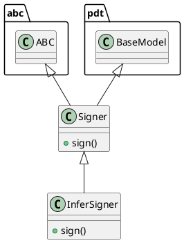

# Document: src/autogen_team/infrastructure/utils/signers.py

## Module Overview

Generate signatures for AI/ML models.

### Purpose
Provides functionality for `signers`.

### Responsibilities
Handles operations and definitions related to `signers`.

### Main Workflow
Execution flow defined by the functions and classes in the module.

### Dependencies
- `abc`
- `typing`
- `mlflow`
- `pydantic`
- `mlflow.models.signature`
- `autogen_team.core.schemas`

## Public API

### Exported Classes
- `Signer`
- `InferSigner`

### Exported Functions
None

## Class `Signer`

### Overview

Base class for generating model signatures.

Allow to switch between model signing strategies.
e.g., automatic inference, manual model signature, ...

https://mlflow.org/docs/latest/models.html#model-signature-and-input-example

### Attributes

- `KIND` (str): Public property.

### Public Method `sign`

#### Description
Generate a model signature from its inputs/outputs.

Args:
    inputs (schemas.Inputs): inputs data.
    outputs (schemas.Outputs): outputs data.

Returns:
    Signature: signature of the model.

#### Inputs
- `inputs` (schemas.Inputs): semantic meaning. Required.
- `outputs` (schemas.Outputs): semantic meaning. Required.

#### Output
- Return type: `Signature`
- Semantic meaning: Result of the operation.

#### Side Effects
May update internal state or external services.

#### Complexity
- Time Complexity: O(1) mostly.
- Space Complexity: O(1) mostly.

#### Example
```python
# Example usage of sign
instance.sign()
```

## Class `InferSigner`

### Overview

Generate model signatures from inputs/outputs data.

### Attributes

- `KIND` (T.Literal[InferSigner]): Public property.

### Public Method `sign`

#### Description
No description provided.

#### Inputs
- `inputs` (schemas.Inputs): semantic meaning. Required.
- `outputs` (schemas.Outputs): semantic meaning. Required.

#### Output
- Return type: `Signature`
- Semantic meaning: Result of the operation.

#### Side Effects
May update internal state or external services.

#### Complexity
- Time Complexity: O(1) mostly.
- Space Complexity: O(1) mostly.

#### Example
```python
# Example usage of sign
instance.sign()
```

## UML Diagram



