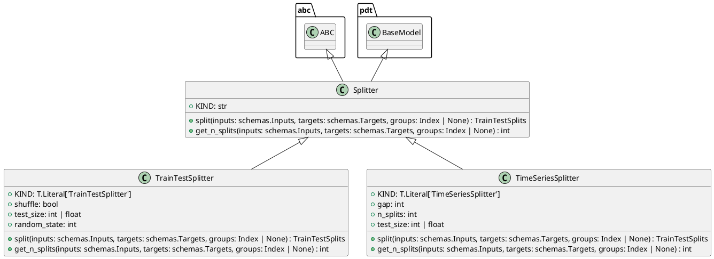

# Module Specification: splitters

* **Source Reference:** `src/autogen_team/infrastructure/utils/splitters.py`

## 1. Architectural Role & Responsibilities
**Purpose:**
Split dataframes into subsets (e.g., train/valid/test).

**Responsibilities:**
- [LLM Synthesis Required: Define responsibilities]

**Main Workflow:**
- [LLM Synthesis Required: Define main workflow]

## 2. Dependencies
**Imports:**
- `abc`
- `typing`
- `numpy`
- `numpy.typing`
- `pydantic`
- `sklearn.model_selection`
- `autogen_team.core.schemas`

**Exported Classes:**
- `Splitter`
- `TrainTestSplitter`
- `TimeSeriesSplitter`

**Exported Functions:**

## 3. Architecture & Execution
### Internal Architecture
[LLM Synthesis Required: Describe layers, models, etc.]

### Execution Flow
[LLM Synthesis Required: Describe execution flow]

### Sequence Explanation
[LLM Synthesis Required: Describe sequence]

## 4. UML 2.0 Diagrams
### Class Diagram


## 5. Class & Method Specifications
### `Splitter` ([`src/autogen_team/infrastructure/utils/splitters.py`](/src/autogen_team/infrastructure/utils/splitters.py))
#### Overview
Base class for a splitter.

Use splitters to split data in sets.
e.g., split between a train/test subsets.

# https://scikit-learn.org/stable/glossary.html#term-CV-splitter

#### Constructor
**Initialization:** Default constructor. Initializes an empty instance.

#### Attributes
- `KIND` (`str`): Maintains the state for KIND.

#### Methods
##### `split(self: Any, inputs: schemas.Inputs, targets: schemas.Targets, groups: Index | None) -> TrainTestSplits` (Public)
**Description:** Split a dataframe into subsets.

Args:
    inputs (schemas.Inputs): model inputs.
    targets (schemas.Targets): model targets.
    groups (Index | None, optional): group labels.

Returns:
    TrainTestSplits: iterator over the dataframe train/test splits.

**Inputs:**
- `inputs` (`schemas.Inputs`): Input parameter dictating the behavior of split.
- `targets` (`schemas.Targets`): Input parameter dictating the behavior of split.
- `groups` (`Index | None`): Input parameter dictating the behavior of split.

**Output:**
- Return Type: `TrainTestSplits`
- Semantic Meaning: The resulting value after processing the split action.

**Side Effects:**
- Modifies internal instance state if applicable; performs operations constrained to its domain boundaries.

**Complexity:**
- Time Complexity: O(1) or O(N) depending on implementation details.
- Space Complexity: O(1) auxiliary space expected.

**Example:**
```python
instance = Splitter()
result = instance.split(...)
```

##### `get_n_splits(self: Any, inputs: schemas.Inputs, targets: schemas.Targets, groups: Index | None) -> int` (Public)
**Description:** Get the number of splits generated.

Args:
    inputs (schemas.Inputs): models inputs.
    targets (schemas.Targets): model targets.
    groups (Index | None, optional): group labels.

Returns:
    int: number of splits generated.

**Inputs:**
- `inputs` (`schemas.Inputs`): Input parameter dictating the behavior of get_n_splits.
- `targets` (`schemas.Targets`): Input parameter dictating the behavior of get_n_splits.
- `groups` (`Index | None`): Input parameter dictating the behavior of get_n_splits.

**Output:**
- Return Type: `int`
- Semantic Meaning: The resulting value after processing the get_n_splits action.

**Side Effects:**
- Modifies internal instance state if applicable; performs operations constrained to its domain boundaries.

**Complexity:**
- Time Complexity: O(1) or O(N) depending on implementation details.
- Space Complexity: O(1) auxiliary space expected.

**Example:**
```python
instance = Splitter()
result = instance.get_n_splits(...)
```

### `TrainTestSplitter` ([`src/autogen_team/infrastructure/utils/splitters.py`](/src/autogen_team/infrastructure/utils/splitters.py))
#### Overview
Split a dataframe into a train and test set.

Parameters:
    shuffle (bool): shuffle the dataset. Default is False.
    test_size (int | float): number/ratio for the test set.
    random_state (int): random state for the splitter object.

#### Constructor
**Initialization:** Default constructor. Initializes an empty instance.

#### Attributes
- `KIND` (`T.Literal['TrainTestSplitter']`): Maintains the state for KIND.
- `shuffle` (`bool`): Maintains the state for shuffle.
- `test_size` (`int | float`): Maintains the state for test_size.
- `random_state` (`int`): Maintains the state for random_state.

#### Methods
##### `split(self: Any, inputs: schemas.Inputs, targets: schemas.Targets, groups: Index | None) -> TrainTestSplits` (Public)
**Description:** Executes the split operation, mutating state or calculating derived values as necessary.

**Inputs:**
- `inputs` (`schemas.Inputs`): Input parameter dictating the behavior of split.
- `targets` (`schemas.Targets`): Input parameter dictating the behavior of split.
- `groups` (`Index | None`): Input parameter dictating the behavior of split.

**Output:**
- Return Type: `TrainTestSplits`
- Semantic Meaning: The resulting value after processing the split action.

**Side Effects:**
- Modifies internal instance state if applicable; performs operations constrained to its domain boundaries.

**Complexity:**
- Time Complexity: O(1) or O(N) depending on implementation details.
- Space Complexity: O(1) auxiliary space expected.

**Example:**
```python
instance = TrainTestSplitter()
result = instance.split(...)
```

##### `get_n_splits(self: Any, inputs: schemas.Inputs, targets: schemas.Targets, groups: Index | None) -> int` (Public)
**Description:** Executes the get_n_splits operation, mutating state or calculating derived values as necessary.

**Inputs:**
- `inputs` (`schemas.Inputs`): Input parameter dictating the behavior of get_n_splits.
- `targets` (`schemas.Targets`): Input parameter dictating the behavior of get_n_splits.
- `groups` (`Index | None`): Input parameter dictating the behavior of get_n_splits.

**Output:**
- Return Type: `int`
- Semantic Meaning: The resulting value after processing the get_n_splits action.

**Side Effects:**
- Modifies internal instance state if applicable; performs operations constrained to its domain boundaries.

**Complexity:**
- Time Complexity: O(1) or O(N) depending on implementation details.
- Space Complexity: O(1) auxiliary space expected.

**Example:**
```python
instance = TrainTestSplitter()
result = instance.get_n_splits(...)
```

### `TimeSeriesSplitter` ([`src/autogen_team/infrastructure/utils/splitters.py`](/src/autogen_team/infrastructure/utils/splitters.py))
#### Overview
Split a dataframe into fixed time series subsets.

Parameters:
    gap (int): gap between splits.
    n_splits (int): number of split to generate.
    test_size (int | float): number or ratio for the test dataset.

#### Constructor
**Initialization:** Default constructor. Initializes an empty instance.

#### Attributes
- `KIND` (`T.Literal['TimeSeriesSplitter']`): Maintains the state for KIND.
- `gap` (`int`): Maintains the state for gap.
- `n_splits` (`int`): Maintains the state for n_splits.
- `test_size` (`int | float`): Maintains the state for test_size.

#### Methods
##### `split(self: Any, inputs: schemas.Inputs, targets: schemas.Targets, groups: Index | None) -> TrainTestSplits` (Public)
**Description:** Executes the split operation, mutating state or calculating derived values as necessary.

**Inputs:**
- `inputs` (`schemas.Inputs`): Input parameter dictating the behavior of split.
- `targets` (`schemas.Targets`): Input parameter dictating the behavior of split.
- `groups` (`Index | None`): Input parameter dictating the behavior of split.

**Output:**
- Return Type: `TrainTestSplits`
- Semantic Meaning: The resulting value after processing the split action.

**Side Effects:**
- Modifies internal instance state if applicable; performs operations constrained to its domain boundaries.

**Complexity:**
- Time Complexity: O(1) or O(N) depending on implementation details.
- Space Complexity: O(1) auxiliary space expected.

**Example:**
```python
instance = TimeSeriesSplitter()
result = instance.split(...)
```

##### `get_n_splits(self: Any, inputs: schemas.Inputs, targets: schemas.Targets, groups: Index | None) -> int` (Public)
**Description:** Executes the get_n_splits operation, mutating state or calculating derived values as necessary.

**Inputs:**
- `inputs` (`schemas.Inputs`): Input parameter dictating the behavior of get_n_splits.
- `targets` (`schemas.Targets`): Input parameter dictating the behavior of get_n_splits.
- `groups` (`Index | None`): Input parameter dictating the behavior of get_n_splits.

**Output:**
- Return Type: `int`
- Semantic Meaning: The resulting value after processing the get_n_splits action.

**Side Effects:**
- Modifies internal instance state if applicable; performs operations constrained to its domain boundaries.

**Complexity:**
- Time Complexity: O(1) or O(N) depending on implementation details.
- Space Complexity: O(1) auxiliary space expected.

**Example:**
```python
instance = TimeSeriesSplitter()
result = instance.get_n_splits(...)
```

## 6. Module Functions