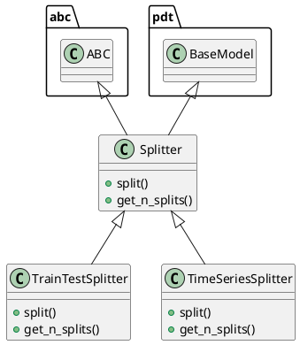

# Document: src/autogen_team/infrastructure/utils/splitters.py

## Module Overview

Split dataframes into subsets (e.g., train/valid/test).

### Purpose
Provides functionality for `splitters`.

### Responsibilities
Handles operations and definitions related to `splitters`.

### Main Workflow
Execution flow defined by the functions and classes in the module.

### Dependencies
- `abc`
- `typing`
- `numpy`
- `numpy.typing`
- `pydantic`
- `sklearn.model_selection`
- `autogen_team.core.schemas`

## Public API

### Exported Classes
- `Splitter`
- `TrainTestSplitter`
- `TimeSeriesSplitter`

### Exported Functions
None

## Class `Splitter`

### Overview

Base class for a splitter.

Use splitters to split data in sets.
e.g., split between a train/test subsets.

# https://scikit-learn.org/stable/glossary.html#term-CV-splitter

### Attributes

- `KIND` (str): Public property.

### Public Method `split`

#### Description
Split a dataframe into subsets.

Args:
    inputs (schemas.Inputs): model inputs.
    targets (schemas.Targets): model targets.
    groups (Index | None, optional): group labels.

Returns:
    TrainTestSplits: iterator over the dataframe train/test splits.

#### Inputs
- `inputs` (schemas.Inputs): semantic meaning. Required.
- `targets` (schemas.Targets): semantic meaning. Required.
- `groups` (Index | None): semantic meaning. Optional (default: `None`).

#### Output
- Return type: `TrainTestSplits`
- Semantic meaning: Result of the operation.

#### Side Effects
May update internal state or external services.

#### Complexity
- Time Complexity: O(1) mostly.
- Space Complexity: O(1) mostly.

#### Example
```python
# Example usage of split
instance.split()
```

### Public Method `get_n_splits`

#### Description
Get the number of splits generated.

Args:
    inputs (schemas.Inputs): models inputs.
    targets (schemas.Targets): model targets.
    groups (Index | None, optional): group labels.

Returns:
    int: number of splits generated.

#### Inputs
- `inputs` (schemas.Inputs): semantic meaning. Required.
- `targets` (schemas.Targets): semantic meaning. Required.
- `groups` (Index | None): semantic meaning. Optional (default: `None`).

#### Output
- Return type: `int`
- Semantic meaning: Result of the operation.

#### Side Effects
May update internal state or external services.

#### Complexity
- Time Complexity: O(1) mostly.
- Space Complexity: O(1) mostly.

#### Example
```python
# Example usage of get_n_splits
instance.get_n_splits()
```

## Class `TrainTestSplitter`

### Overview

Split a dataframe into a train and test set.

Parameters:
    shuffle (bool): shuffle the dataset. Default is False.
    test_size (int | float): number/ratio for the test set.
    random_state (int): random state for the splitter object.

### Attributes

- `KIND` (T.Literal[TrainTestSplitter]): Public property.
- `shuffle` (bool): Public property.
- `test_size` (int | float): Public property.
- `random_state` (int): Public property.

### Public Method `split`

#### Description
No description provided.

#### Inputs
- `inputs` (schemas.Inputs): semantic meaning. Required.
- `targets` (schemas.Targets): semantic meaning. Required.
- `groups` (Index | None): semantic meaning. Optional (default: `None`).

#### Output
- Return type: `TrainTestSplits`
- Semantic meaning: Result of the operation.

#### Side Effects
May update internal state or external services.

#### Complexity
- Time Complexity: O(1) mostly.
- Space Complexity: O(1) mostly.

#### Example
```python
# Example usage of split
instance.split()
```

### Public Method `get_n_splits`

#### Description
No description provided.

#### Inputs
- `inputs` (schemas.Inputs): semantic meaning. Required.
- `targets` (schemas.Targets): semantic meaning. Required.
- `groups` (Index | None): semantic meaning. Optional (default: `None`).

#### Output
- Return type: `int`
- Semantic meaning: Result of the operation.

#### Side Effects
May update internal state or external services.

#### Complexity
- Time Complexity: O(1) mostly.
- Space Complexity: O(1) mostly.

#### Example
```python
# Example usage of get_n_splits
instance.get_n_splits()
```

## Class `TimeSeriesSplitter`

### Overview

Split a dataframe into fixed time series subsets.

Parameters:
    gap (int): gap between splits.
    n_splits (int): number of split to generate.
    test_size (int | float): number or ratio for the test dataset.

### Attributes

- `KIND` (T.Literal[TimeSeriesSplitter]): Public property.
- `gap` (int): Public property.
- `n_splits` (int): Public property.
- `test_size` (int | float): Public property.

### Public Method `split`

#### Description
No description provided.

#### Inputs
- `inputs` (schemas.Inputs): semantic meaning. Required.
- `targets` (schemas.Targets): semantic meaning. Required.
- `groups` (Index | None): semantic meaning. Optional (default: `None`).

#### Output
- Return type: `TrainTestSplits`
- Semantic meaning: Result of the operation.

#### Side Effects
May update internal state or external services.

#### Complexity
- Time Complexity: O(1) mostly.
- Space Complexity: O(1) mostly.

#### Example
```python
# Example usage of split
instance.split()
```

### Public Method `get_n_splits`

#### Description
No description provided.

#### Inputs
- `inputs` (schemas.Inputs): semantic meaning. Required.
- `targets` (schemas.Targets): semantic meaning. Required.
- `groups` (Index | None): semantic meaning. Optional (default: `None`).

#### Output
- Return type: `int`
- Semantic meaning: Result of the operation.

#### Side Effects
May update internal state or external services.

#### Complexity
- Time Complexity: O(1) mostly.
- Space Complexity: O(1) mostly.

#### Example
```python
# Example usage of get_n_splits
instance.get_n_splits()
```

## UML Diagram



